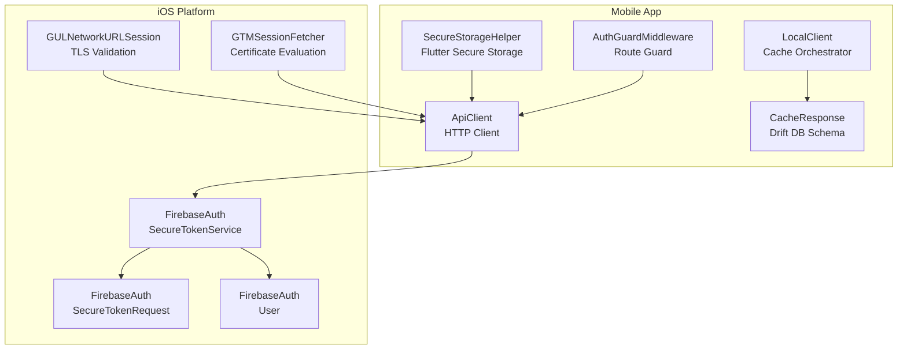
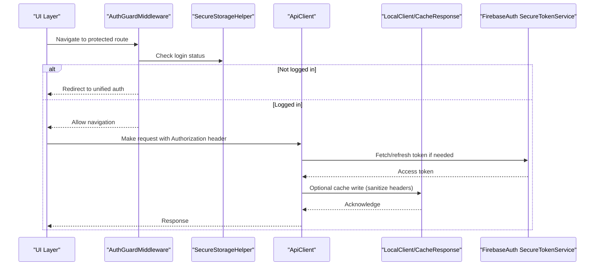
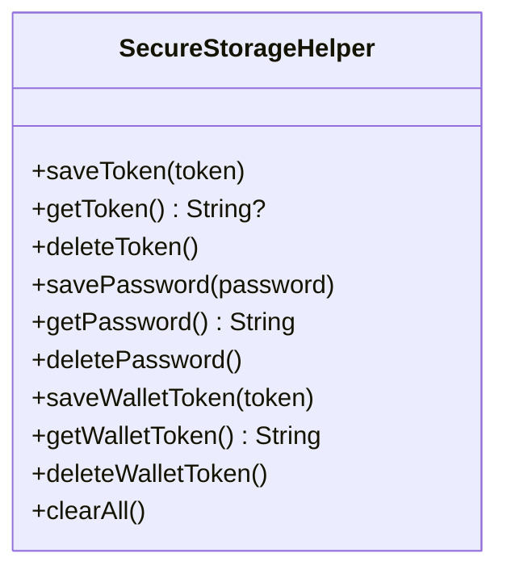
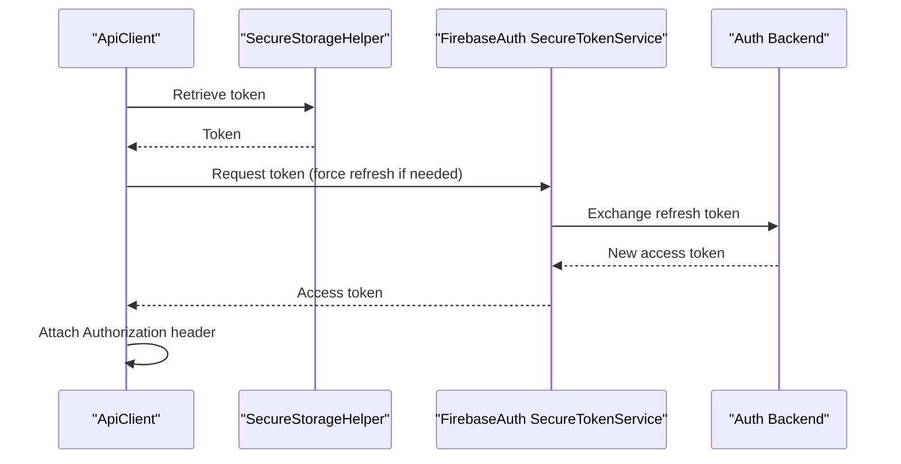
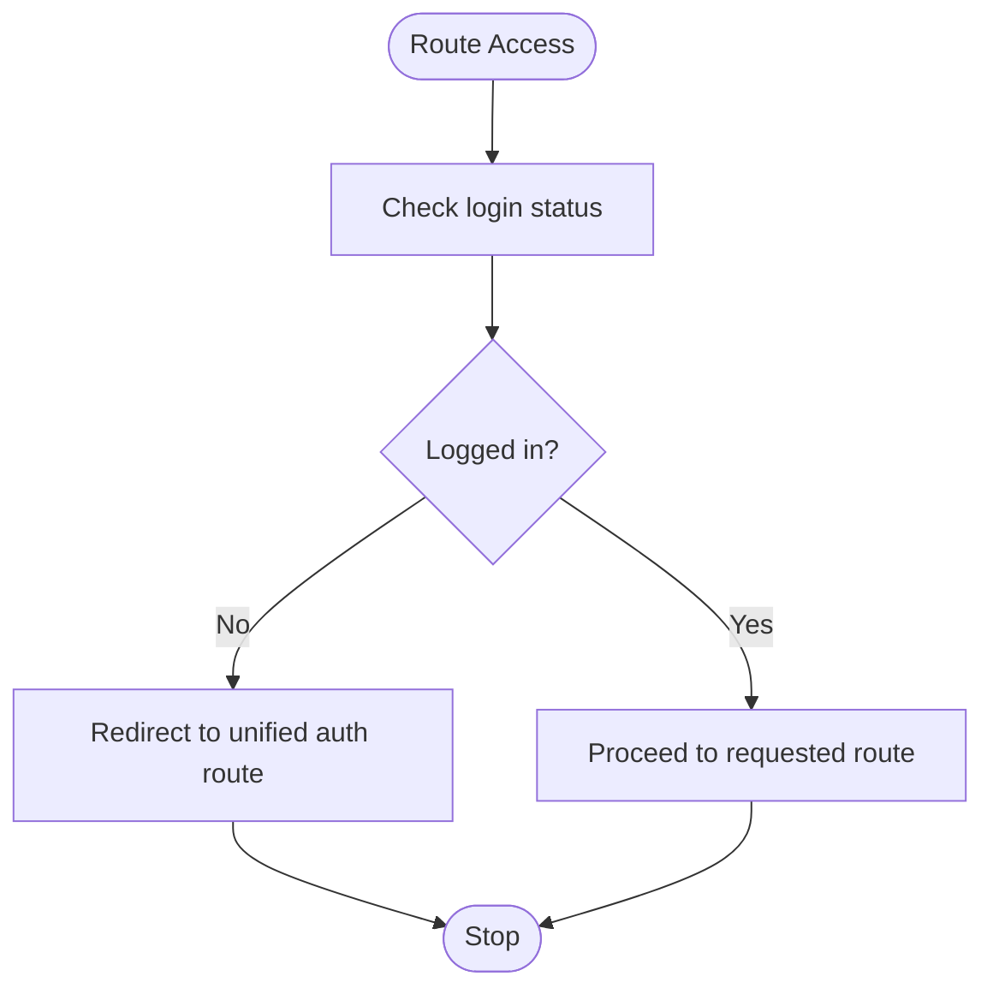
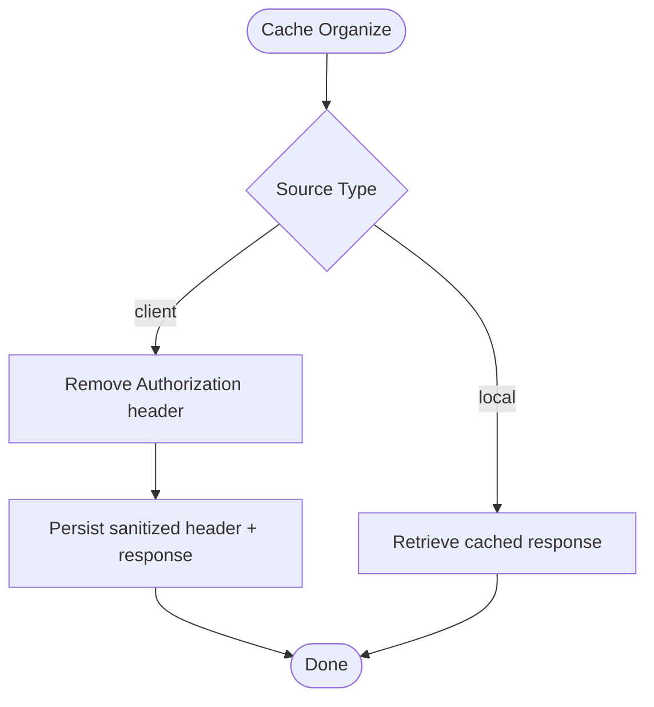
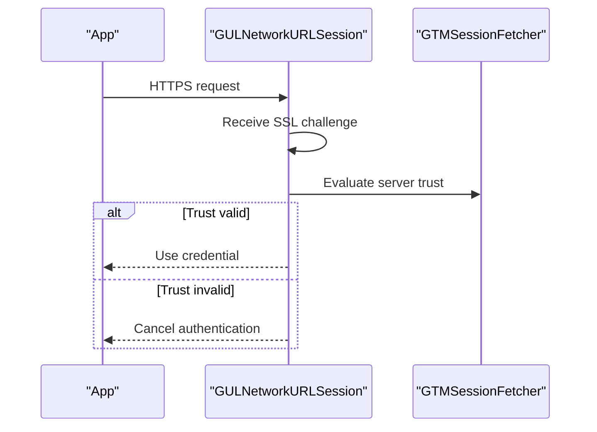
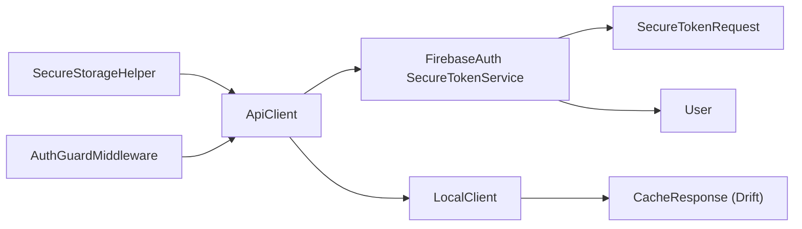

# Security Considerations

<cite>
**Referenced Files in This Document**
- [secure_storage_helper.dart](file://lib/helper/secure_storage_helper.dart)
- [api_client.dart](file://lib/api/api_client.dart)
- [local_client.dart](file://lib/api/local_client.dart)
- [auth_guard_middleware.dart](file://lib/common/widgets/auth_guard_middleware.dart)
- [cache_response.dart](file://lib/local/cache_response.dart)
- [SecureTokenService.swift](file://ios/Pods/FirebaseAuth/FirebaseAuth/Sources/Swift/SystemService/SecureTokenService.swift)
- [SecureTokenRequest.swift](file://ios/Pods/FirebaseAuth/FirebaseAuth/Sources/Swift/Backend/RPC/SecureTokenRequest.swift)
- [User.swift](file://ios/Pods/FirebaseAuth/FirebaseAuth/Sources/Swift/User/User.swift)
- [GULNetworkURLSession.m](file://ios/Pods/GoogleUtilities/GoogleUtilities/Network/GULNetworkURLSession.m)
- [GTMSessionFetcher.m](file://ios/Pods/GTMSessionFetcher/Sources/Core/GTMSessionFetcher.m)
- [flutter_secure_storage.podspec.json](file://ios/Pods/Local Podspecs/flutter_secure_storage.podspec.json)
</cite>

## Table of Contents
1. [Introduction](#introduction)
2. [Project Structure](#project-structure)
3. [Core Components](#core-components)
4. [Architecture Overview](#architecture-overview)
5. [Detailed Component Analysis](#detailed-component-analysis)
6. [Dependency Analysis](#dependency-analysis)
7. [Performance Considerations](#performance-considerations)
8. [Privacy Compliance and Consent](#privacy-compliance-and-consent)
9. [Secure Coding Practices](#secure-coding-practices)
10. [Security Testing and Audits](#security-testing-and-audits)
11. [Incident Response and Monitoring](#incident-response-and-monitoring)
12. [Conclusion](#conclusion)

## Introduction
This document consolidates security considerations for the project with a focus on data encryption, secure authentication, privacy protection, and compliance standards. It explains secure storage implementation, token management, sensitive data handling, authentication and session management, authorization patterns, encryption strategies for local data and network communications, API protection, privacy compliance requirements, user consent mechanisms, secure coding practices, vulnerability prevention, security testing, and incident response procedures.

## Project Structure
Security-relevant components are organized across helper utilities, API clients, local caching, and platform-specific integrations:
- Authentication and token management via Firebase Auth on iOS and Flutter secure storage on both platforms.
- API client handling HTTP requests, headers, timeouts, and response processing.
- Local caching with Drift database and SharedPreferences, including sensitive header stripping.
- Middleware enforcing authentication guards for protected routes.

**Diagram sources**
- [secure_storage_helper.dart:1-56](file://lib/helper/secure_storage_helper.dart#L1-L56)
- [api_client.dart:1-245](file://lib/api/api_client.dart#L1-L245)
- [local_client.dart:1-62](file://lib/api/local_client.dart#L1-L62)
- [auth_guard_middleware.dart:1-20](file://lib/common/widgets/auth_guard_middleware.dart#L1-L20)
- [cache_response.dart:1-81](file://lib/local/cache_response.dart#L1-L81)
- [SecureTokenService.swift:1-75](file://ios/Pods/FirebaseAuth/FirebaseAuth/Sources/Swift/SystemService/SecureTokenService.swift#L1-L75)
- [SecureTokenRequest.swift:1-37](file://ios/Pods/FirebaseAuth/FirebaseAuth/Sources/Swift/Backend/RPC/SecureTokenRequest.swift#L1-L37)
- [User.swift:576-640](file://ios/Pods/FirebaseAuth/FirebaseAuth/Sources/Swift/User/User.swift#L576-L640)
- [GULNetworkURLSession.m:333-391](file://ios/Pods/GoogleUtilities/GoogleUtilities/Network/GULNetworkURLSession.m#L333-L391)
- [GTMSessionFetcher.m:2563-2588](file://ios/Pods/GTMSessionFetcher/Sources/Core/GTMSessionFetcher.m#L2563-L2588)

**Section sources**
- [secure_storage_helper.dart:1-56](file://lib/helper/secure_storage_helper.dart#L1-L56)
- [api_client.dart:1-245](file://lib/api/api_client.dart#L1-L245)
- [local_client.dart:1-62](file://lib/api/local_client.dart#L1-L62)
- [auth_guard_middleware.dart:1-20](file://lib/common/widgets/auth_guard_middleware.dart#L1-L20)
- [cache_response.dart:1-81](file://lib/local/cache_response.dart#L1-L81)

## Core Components
- Secure storage helper encapsulates token and password persistence using Flutter Secure Storage with Android encrypted shared preferences enabled.
- API client manages HTTP requests, Authorization headers, timeouts, and response handling, including error normalization.
- Local client orchestrates caching strategies across Web and native platforms, sanitizing sensitive headers before persisting.
- Drift database schema defines cache storage with unique endpoint indexing and migration strategy.
- Auth guard middleware enforces authentication checks for protected routes.
- iOS Firebase Auth integrates Secure Token Service for token retrieval and refresh, with automatic token expiration handling and retry logic.
- Network stack validates TLS certificates and enforces HTTPS behavior.

**Section sources**
- [secure_storage_helper.dart:1-56](file://lib/helper/secure_storage_helper.dart#L1-L56)
- [api_client.dart:18-68](file://lib/api/api_client.dart#L18-L68)
- [local_client.dart:10-62](file://lib/api/local_client.dart#L10-L62)
- [cache_response.dart:5-37](file://lib/local/cache_response.dart#L5-L37)
- [auth_guard_middleware.dart:8-18](file://lib/common/widgets/auth_guard_middleware.dart#L8-L18)
- [SecureTokenService.swift:145-162](file://ios/Pods/FirebaseAuth/FirebaseAuth/Sources/Swift/SystemService/SecureTokenService.swift#L145-L162)
- [GULNetworkURLSession.m:333-391](file://ios/Pods/GoogleUtilities/GoogleUtilities/Network/GULNetworkURLSession.m#L333-L391)

## Architecture Overview
The system integrates Flutter mobile logic with iOS platform security primitives:
- Tokens are stored securely on-device and attached to API requests via Authorization headers.
- Sensitive headers are stripped before caching to prevent accidental exposure.
- Drift-backed cache persists sanitized responses keyed by endpoint.
- Auth guard middleware ensures only authenticated users can access protected routes.
- iOS Firebase Auth handles token lifecycle, refresh, and automatic invalidation.

**Diagram sources**
- [auth_guard_middleware.dart:12-18](file://lib/common/widgets/auth_guard_middleware.dart#L12-L18)
- [secure_storage_helper.dart:13-23](file://lib/helper/secure_storage_helper.dart#L13-L23)
- [api_client.dart:46-66](file://lib/api/api_client.dart#L46-L66)
- [local_client.dart:24-38](file://lib/api/local_client.dart#L24-L38)
- [cache_response.dart:39-53](file://lib/local/cache_response.dart#L39-L53)
- [SecureTokenService.swift:27-35](file://ios/Pods/FirebaseAuth/FirebaseAuth/Sources/Swift/SystemService/SecureTokenService.swift#L27-L35)

## Detailed Component Analysis

### Secure Storage Implementation
- Uses Flutter Secure Storage with Android encrypted shared preferences enabled to store tokens and passwords.
- Provides dedicated keys for auth token, user password, and wallet token.
- Offers clear-all capability on logout to remove persisted credentials.

**Diagram sources**
- [secure_storage_helper.dart:3-55](file://lib/helper/secure_storage_helper.dart#L3-L55)

**Section sources**
- [secure_storage_helper.dart:1-56](file://lib/helper/secure_storage_helper.dart#L1-L56)

### Token Management and Authentication Security
- API client composes Authorization headers with Bearer tokens retrieved from secure storage.
- iOS Firebase Auth Secure Token Service manages access and refresh tokens, with automatic refresh scheduling and retry logic.
- Token expiration and invalidation are handled, including automatic sign-out on invalid user tokens.

**Diagram sources**
- [api_client.dart:46-66](file://lib/api/api_client.dart#L46-L66)
- [SecureTokenService.swift:27-35](file://ios/Pods/FirebaseAuth/FirebaseAuth/Sources/Swift/SystemService/SecureTokenService.swift#L27-L35)
- [SecureTokenRequest.swift:17-29](file://ios/Pods/FirebaseAuth/FirebaseAuth/Sources/Swift/Backend/RPC/SecureTokenRequest.swift#L17-L29)
- [User.swift:586-619](file://ios/Pods/FirebaseAuth/FirebaseAuth/Sources/Swift/User/User.swift#L586-L619)

**Section sources**
- [api_client.dart:46-66](file://lib/api/api_client.dart#L46-L66)
- [SecureTokenService.swift:145-162](file://ios/Pods/FirebaseAuth/FirebaseAuth/Sources/Swift/SystemService/SecureTokenService.swift#L145-L162)
- [SecureTokenRequest.swift:1-37](file://ios/Pods/FirebaseAuth/FirebaseAuth/Sources/Swift/Backend/RPC/SecureTokenRequest.swift#L1-L37)
- [User.swift:1574-1586](file://ios/Pods/FirebaseAuth/FirebaseAuth/Sources/Swift/User/User.swift#L1574-L1586)

### Session Management and Authorization Patterns
- Auth guard middleware redirects unauthenticated users to a unified authentication route, ensuring route-level authorization.
- API client centralizes header composition, including zone, localization, and coordinates, while preserving Authorization.

**Diagram sources**
- [auth_guard_middleware.dart:12-18](file://lib/common/widgets/auth_guard_middleware.dart#L12-L18)

**Section sources**
- [auth_guard_middleware.dart:1-20](file://lib/common/widgets/auth_guard_middleware.dart#L1-L20)
- [api_client.dart:46-66](file://lib/api/api_client.dart#L46-L66)

### Secure Local Data Storage and Caching
- Local caching strips Authorization headers before persisting responses to reduce risk of credential exposure.
- Drift database schema supports unique endpoint indexing, insert-or-update semantics, and migrations.

**Diagram sources**
- [local_client.dart:12-38](file://lib/api/local_client.dart#L12-L38)
- [cache_response.dart:5-10](file://lib/local/cache_response.dart#L5-L10)
- [cache_response.dart:39-53](file://lib/local/cache_response.dart#L39-L53)

**Section sources**
- [local_client.dart:10-62](file://lib/api/local_client.dart#L10-L62)
- [cache_response.dart:1-81](file://lib/local/cache_response.dart#L1-L81)

### Network Security and API Communication Protection
- iOS network utilities validate server trust and enforce TLS challenges, canceling authentication when trust cannot be verified.
- GTMSessionFetcher enforces HTTPS and validates certificate chains to mitigate man-in-the-middle risks.

**Diagram sources**
- [GULNetworkURLSession.m:333-391](file://ios/Pods/GoogleUtilities/GoogleUtilities/Network/GULNetworkURLSession.m#L333-L391)
- [GTMSessionFetcher.m:2581-2588](file://ios/Pods/GTMSessionFetcher/Sources/Core/GTMSessionFetcher.m#L2581-L2588)

**Section sources**
- [GULNetworkURLSession.m:333-391](file://ios/Pods/GoogleUtilities/GoogleUtilities/Network/GULNetworkURLSession.m#L333-L391)
- [GTMSessionFetcher.m:2563-2588](file://ios/Pods/GTMSessionFetcher/Sources/Core/GTMSessionFetcher.m#L2563-L2588)

### Privacy Compliance and Consent
- The project integrates flutter_secure_storage, which includes a privacy manifest resource bundle indicating data collection practices and purposes.
- Ensure user consent is obtained for data processing activities and that privacy policies are accessible to users.

**Section sources**
- [flutter_secure_storage.podspec.json:29-32](file://ios/Pods/Local Podspecs/flutter_secure_storage.podspec.json#L29-L32)

## Dependency Analysis
- SecureStorageHelper depends on Flutter Secure Storage and AndroidOptions for encrypted shared preferences.
- ApiClient depends on shared preferences for token retrieval and constructs Authorization headers.
- LocalClient depends on SharedPreferences for Web and Drift database for native caching.
- Auth guard middleware depends on AuthHelper and RouteHelper for redirection logic.
- iOS Firebase Auth components depend on SecureTokenService, SecureTokenRequest, and User APIs for token lifecycle.

**Diagram sources**
- [secure_storage_helper.dart:1-56](file://lib/helper/secure_storage_helper.dart#L1-L56)
- [api_client.dart:18-68](file://lib/api/api_client.dart#L18-L68)
- [local_client.dart:1-62](file://lib/api/local_client.dart#L1-L62)
- [cache_response.dart:1-81](file://lib/local/cache_response.dart#L1-L81)
- [auth_guard_middleware.dart:1-20](file://lib/common/widgets/auth_guard_middleware.dart#L1-L20)
- [SecureTokenService.swift:1-75](file://ios/Pods/FirebaseAuth/FirebaseAuth/Sources/Swift/SystemService/SecureTokenService.swift#L1-L75)
- [SecureTokenRequest.swift:1-37](file://ios/Pods/FirebaseAuth/FirebaseAuth/Sources/Swift/Backend/RPC/SecureTokenRequest.swift#L1-L37)
- [User.swift:576-640](file://ios/Pods/FirebaseAuth/FirebaseAuth/Sources/Swift/User/User.swift#L576-L640)

**Section sources**
- [secure_storage_helper.dart:1-56](file://lib/helper/secure_storage_helper.dart#L1-L56)
- [api_client.dart:18-68](file://lib/api/api_client.dart#L18-L68)
- [local_client.dart:1-62](file://lib/api/local_client.dart#L1-L62)
- [cache_response.dart:1-81](file://lib/local/cache_response.dart#L1-L81)
- [auth_guard_middleware.dart:1-20](file://lib/common/widgets/auth_guard_middleware.dart#L1-L20)
- [SecureTokenService.swift:1-75](file://ios/Pods/FirebaseAuth/FirebaseAuth/Sources/Swift/SystemService/SecureTokenService.swift#L1-L75)
- [SecureTokenRequest.swift:1-37](file://ios/Pods/FirebaseAuth/FirebaseAuth/Sources/Swift/Backend/RPC/SecureTokenRequest.swift#L1-L37)
- [User.swift:576-640](file://ios/Pods/FirebaseAuth/FirebaseAuth/Sources/Swift/User/User.swift#L576-L640)

## Performance Considerations
- Prefer token reuse and minimize forced refreshes to reduce latency and backend load.
- Cache sanitized responses locally to decrease network overhead while avoiding sensitive header exposure.
- Use timeouts and structured error handling to prevent indefinite waits and improve resilience.

## Privacy Compliance and Consent
- Ensure user consent is obtained for data processing and analytics.
- Provide transparent privacy notices and enable users to manage consent preferences.
- Limit data retention and implement secure deletion mechanisms upon logout.

## Secure Coding Practices
- Validate and sanitize all inputs to prevent injection attacks.
- Enforce HTTPS-only communication and certificate pinning where applicable.
- Avoid logging sensitive data, including tokens and personal information.
- Regularly update dependencies and apply security patches.

## Security Testing and Audits
- Conduct static application security testing (SAST) and dynamic application security testing (DAST).
- Perform penetration testing against API endpoints and authentication flows.
- Audit cryptographic implementations and token lifecycle management.
- Review third-party SDKs for security posture and compliance.

## Incident Response and Monitoring
- Establish alerting for anomalous authentication attempts, token refresh failures, and unauthorized access patterns.
- Monitor API error rates and response anomalies indicative of tampering or credential theft.
- Maintain incident response playbooks for credential compromise, data exposure, and service degradation.

## Conclusion
The project implements layered security controls: secure on-device storage, robust token lifecycle management via Firebase Auth, route-level authorization, and secure local caching with sensitive header sanitization. Strengthening privacy compliance, continuous security testing, and proactive monitoring will further enhance the system’s resilience and trustworthiness.