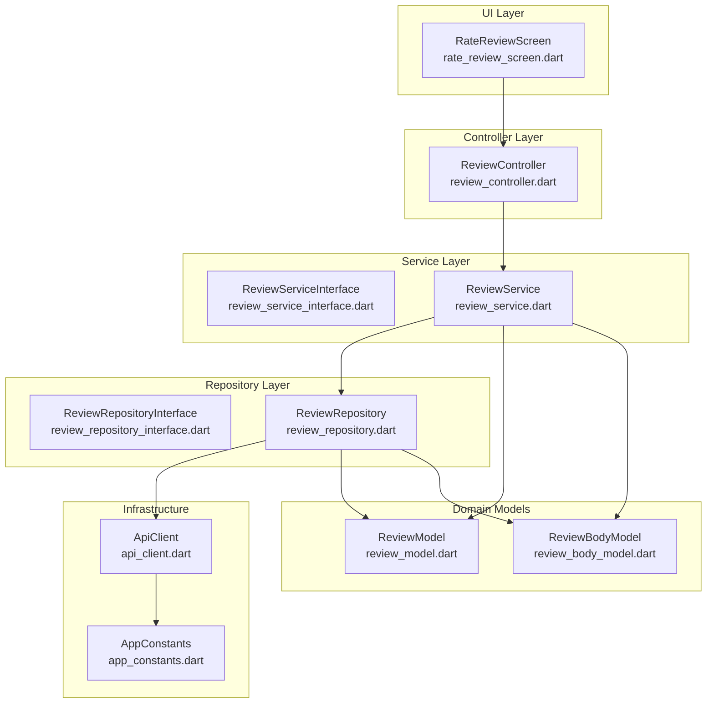
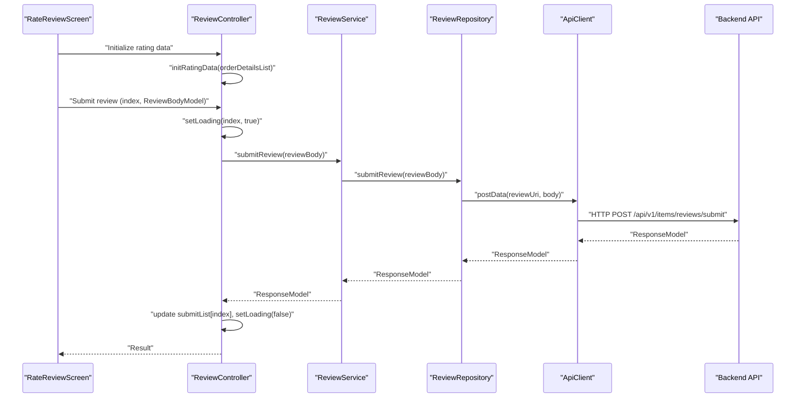
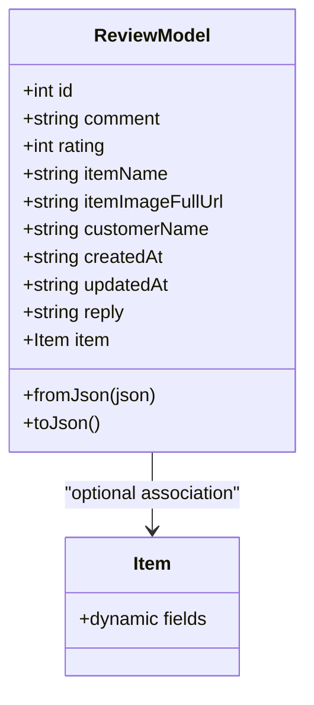
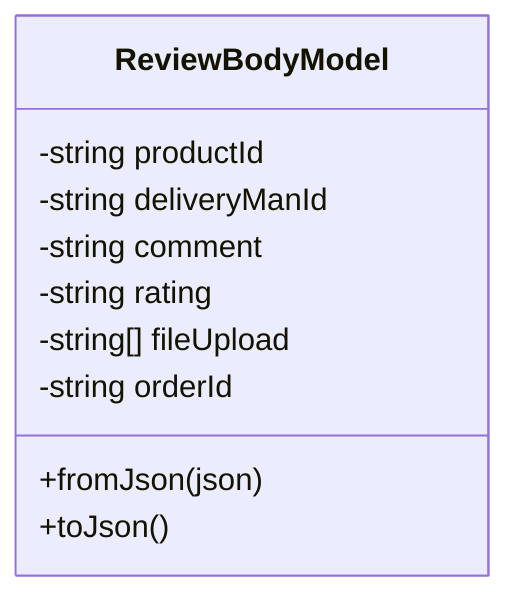
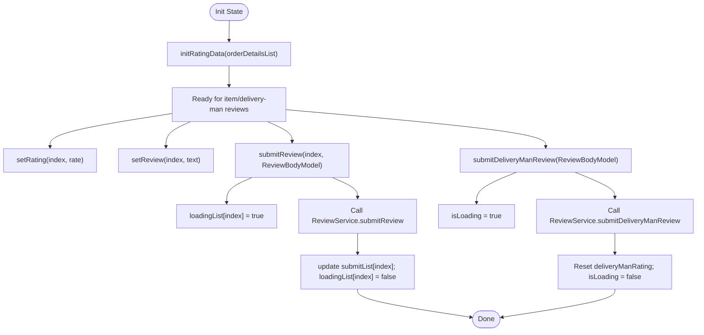
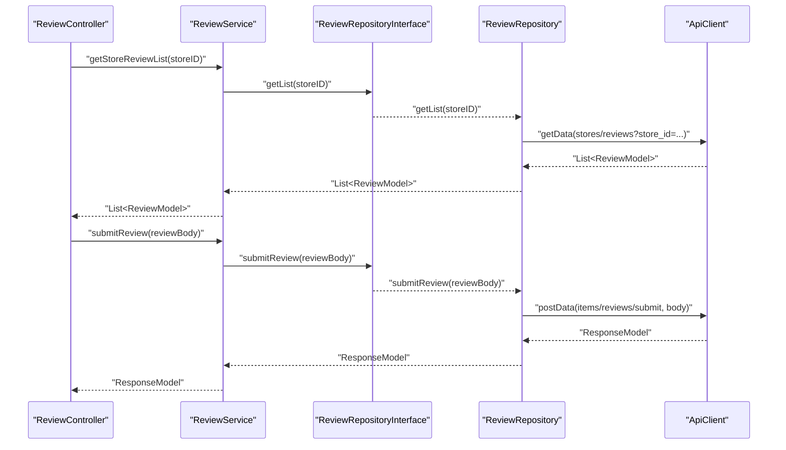
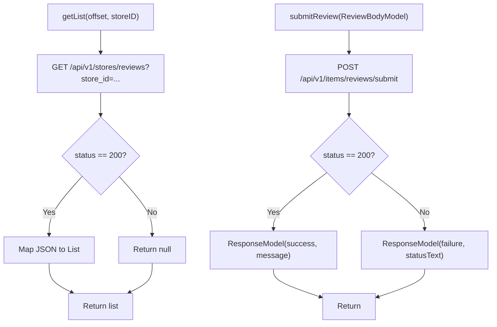
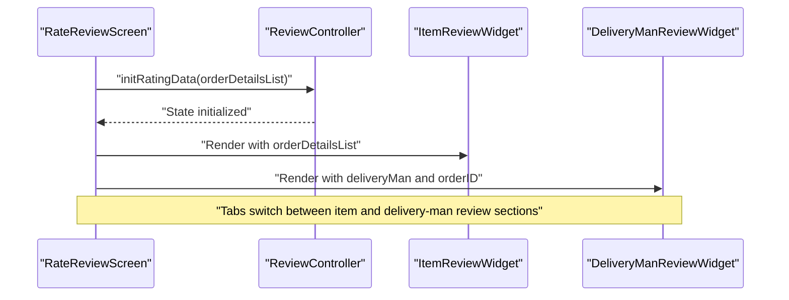
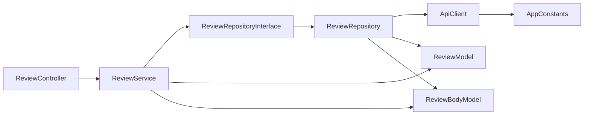

# Product Reviews and Ratings

<cite>
**Referenced Files in This Document**
- [review_model.dart](file://lib/features/review/domain/models/review_model.dart)
- [review_body_model.dart](file://lib/features/review/domain/models/review_body_model.dart)
- [review_controller.dart](file://lib/features/review/controllers/review_controller.dart)
- [review_service_interface.dart](file://lib/features/review/domain/services/review_service_interface.dart)
- [review_service.dart](file://lib/features/review/domain/services/review_service.dart)
- [review_repository_interface.dart](file://lib/features/review/domain/repositories/review_repository_interface.dart)
- [review_repository.dart](file://lib/features/review/domain/repositories/review_repository.dart)
- [rate_review_screen.dart](file://lib/features/review/screens/rate_review_screen.dart)
- [app_constants.dart](file://lib/util/app_constants.dart)
- [api_client.dart](file://lib/api/api_client.dart)
</cite>

## Table of Contents
1. [Introduction](#introduction)
2. [Project Structure](#project-structure)
3. [Core Components](#core-components)
4. [Architecture Overview](#architecture-overview)
5. [Detailed Component Analysis](#detailed-component-analysis)
6. [Dependency Analysis](#dependency-analysis)
7. [Performance Considerations](#performance-considerations)
8. [Troubleshooting Guide](#troubleshooting-guide)
9. [Conclusion](#conclusion)
10. [Appendices](#appendices)

## Introduction
This document explains the product reviews and ratings system implemented in the application. It covers the review submission process, rating calculation mechanics, moderation workflows, controller state management, data validation, and approval processes. It also documents the review model structure, repository responsibilities for data retrieval and submission, and the service’s business logic for aggregating ratings and ensuring quality. Integration points with user profiles, product catalogs, and seller performance metrics are described, along with spam prevention, verification, and community moderation features.

## Project Structure
The review system is organized around a layered architecture:
- Domain models define the shape of review data and submission payloads.
- Controllers manage UI state and orchestrate interactions.
- Services encapsulate business logic and coordinate with repositories.
- Repositories handle API communication and data transformation.
- Screens wire up the UI and pass data to controllers.

**Diagram sources**
- [rate_review_screen.dart:13-78](file://lib/features/review/screens/rate_review_screen.dart#L13-L78)
- [review_controller.dart:9-101](file://lib/features/review/controllers/review_controller.dart#L9-L101)
- [review_service_interface.dart:5-9](file://lib/features/review/domain/services/review_service_interface.dart#L5-L9)
- [review_service.dart:7-28](file://lib/features/review/domain/services/review_service.dart#L7-L28)
- [review_repository_interface.dart:5-10](file://lib/features/review/domain/repositories/review_repository_interface.dart#L5-L10)
- [review_repository.dart:9-68](file://lib/features/review/domain/repositories/review_repository.dart#L9-L68)
- [review_model.dart:3-58](file://lib/features/review/domain/models/review_model.dart#L3-L58)
- [review_body_model.dart:1-51](file://lib/features/review/domain/models/review_body_model.dart#L1-L51)
- [api_client.dart:18-245](file://lib/api/api_client.dart#L18-L245)
- [app_constants.dart:66-87](file://lib/util/app_constants.dart#L66-L87)

**Section sources**
- [rate_review_screen.dart:13-78](file://lib/features/review/screens/rate_review_screen.dart#L13-L78)
- [review_controller.dart:9-101](file://lib/features/review/controllers/review_controller.dart#L9-L101)
- [review_service.dart:7-28](file://lib/features/review/domain/services/review_service.dart#L7-L28)
- [review_repository.dart:9-68](file://lib/features/review/domain/repositories/review_repository.dart#L9-L68)
- [review_model.dart:3-58](file://lib/features/review/domain/models/review_model.dart#L3-L58)
- [review_body_model.dart:1-51](file://lib/features/review/domain/models/review_body_model.dart#L1-L51)
- [api_client.dart:18-245](file://lib/api/api_client.dart#L18-L245)
- [app_constants.dart:66-87](file://lib/util/app_constants.dart#L66-L87)

## Core Components
- ReviewModel: Represents a single review with identifiers, rating, comments, timestamps, optional reply, and associated item.
- ReviewBodyModel: Encapsulates the payload for submitting reviews, including product/delivery-man identifiers, rating, comment, attachments, and order ID.
- ReviewController: Manages UI state for multiple item reviews and a delivery man review, including loading and submission flags.
- ReviewServiceInterface and ReviewService: Define and implement business operations for fetching store reviews and submitting item and delivery-man reviews.
- ReviewRepositoryInterface and ReviewRepository: Define and implement data access operations, including retrieving store reviews and posting review submissions.
- RateReviewScreen: Orchestrates the review submission UI with tabbed sections for items and delivery man.

Key responsibilities:
- Data validation: Payloads are constructed via ReviewBodyModel and serialized to JSON before submission.
- State management: ReviewController tracks per-item ratings/comments and submission/loading states.
- API integration: ReviewRepository uses ApiClient to call endpoints defined in AppConstants.
- Moderation hooks: Submission responses return success/failure; moderation workflows are not implemented in code but can be integrated at the API level.

**Section sources**
- [review_model.dart:3-58](file://lib/features/review/domain/models/review_model.dart#L3-L58)
- [review_body_model.dart:1-51](file://lib/features/review/domain/models/review_body_model.dart#L1-L51)
- [review_controller.dart:9-101](file://lib/features/review/controllers/review_controller.dart#L9-L101)
- [review_service_interface.dart:5-9](file://lib/features/review/domain/services/review_service_interface.dart#L5-L9)
- [review_service.dart:7-28](file://lib/features/review/domain/services/review_service.dart#L7-L28)
- [review_repository_interface.dart:5-10](file://lib/features/review/domain/repositories/review_repository_interface.dart#L5-L10)
- [review_repository.dart:9-68](file://lib/features/review/domain/repositories/review_repository.dart#L9-L68)
- [rate_review_screen.dart:13-78](file://lib/features/review/screens/rate_review_screen.dart#L13-L78)

## Architecture Overview
The system follows a clean architecture pattern with clear separation of concerns:
- UI triggers actions via ReviewController.
- Controller delegates to ReviewService for business logic.
- Service coordinates with ReviewRepository for data operations.
- Repository performs HTTP requests using ApiClient and AppConstants endpoints.
- Domain models transform JSON to typed objects and vice versa.

**Diagram sources**
- [rate_review_screen.dart:23-78](file://lib/features/review/screens/rate_review_screen.dart#L23-L78)
- [review_controller.dart:34-86](file://lib/features/review/controllers/review_controller.dart#L34-L86)
- [review_service.dart:17-20](file://lib/features/review/domain/services/review_service.dart#L17-L20)
- [review_repository.dart:24-34](file://lib/features/review/domain/repositories/review_repository.dart#L24-L34)
- [api_client.dart:88-112](file://lib/api/api_client.dart#L88-L112)
- [app_constants.dart:69-74](file://lib/util/app_constants.dart#L69-L74)

## Detailed Component Analysis

### Review Model Structure
ReviewModel captures review metadata and associations:
- Identifiers: id, item association
- Content: comment, reply
- Rating: integer scale
- Timestamps: created_at, updated_at
- Customer context: customer_name
- Item context: item_name, item_image_full_url

**Diagram sources**
- [review_model.dart:3-58](file://lib/features/review/domain/models/review_model.dart#L3-L58)

**Section sources**
- [review_model.dart:3-58](file://lib/features/review/domain/models/review_model.dart#L3-L58)

### Review Body Model for Submissions
ReviewBodyModel defines the payload for review submissions:
- Product/delivery-man linkage: item_id, delivery_man_id
- Rating and comment: rating, comment
- Order context: order_id
- Attachments: attachment (list of URLs or identifiers)
- Serialization: toJson()/fromJson() for API exchange

**Diagram sources**
- [review_body_model.dart:1-51](file://lib/features/review/domain/models/review_body_model.dart#L1-L51)

**Section sources**
- [review_body_model.dart:1-51](file://lib/features/review/domain/models/review_body_model.dart#L1-L51)

### Review Controller State Management
ReviewController manages:
- Store review list: fetch and render
- Per-item rating/comment lists: initialized from order details
- Loading and submission flags per item
- Delivery man rating submission state
- Methods to update ratings/comments and trigger submissions

**Diagram sources**
- [review_controller.dart:44-99](file://lib/features/review/controllers/review_controller.dart#L44-L99)

**Section sources**
- [review_controller.dart:9-101](file://lib/features/review/controllers/review_controller.dart#L9-L101)

### Review Service Business Logic
ReviewService delegates to the repository:
- Fetch store reviews by store ID
- Submit item reviews
- Submit delivery man reviews

**Diagram sources**
- [review_service.dart:11-25](file://lib/features/review/domain/services/review_service.dart#L11-L25)
- [review_repository_interface.dart:7-9](file://lib/features/review/domain/repositories/review_repository_interface.dart#L7-L9)
- [review_repository.dart:14-46](file://lib/features/review/domain/repositories/review_repository.dart#L14-L46)
- [api_client.dart:70-112](file://lib/api/api_client.dart#L70-L112)
- [app_constants.dart:69-86](file://lib/util/app_constants.dart#L69-L86)

**Section sources**
- [review_service.dart:7-28](file://lib/features/review/domain/services/review_service.dart#L7-L28)
- [review_repository_interface.dart:5-10](file://lib/features/review/domain/repositories/review_repository_interface.dart#L5-L10)
- [review_repository.dart:9-68](file://lib/features/review/domain/repositories/review_repository.dart#L9-L68)

### Review Repository Data Access
ReviewRepository handles:
- Retrieving store reviews via GET to stores/reviews with store_id query parameter
- Submitting item reviews via POST to items/reviews/submit
- Submitting delivery man reviews via POST to delivery-man/reviews/submit
- Transforming JSON responses into ReviewModel instances
- Returning ResponseModel with success or error messages

**Diagram sources**
- [review_repository.dart:14-46](file://lib/features/review/domain/repositories/review_repository.dart#L14-L46)
- [app_constants.dart:69-86](file://lib/util/app_constants.dart#L69-L86)

**Section sources**
- [review_repository.dart:9-68](file://lib/features/review/domain/repositories/review_repository.dart#L9-L68)
- [app_constants.dart:66-87](file://lib/util/app_constants.dart#L66-L87)

### UI Integration and Workflows
RateReviewScreen orchestrates:
- Tabbed UI for items and delivery man reviews
- Initialization of rating/comment arrays via ReviewController.initRatingData
- Rendering of ItemReviewWidget and DeliveryManReviewWidget
- Passing order details and delivery man context to respective widgets

**Diagram sources**
- [rate_review_screen.dart:23-78](file://lib/features/review/screens/rate_review_screen.dart#L23-L78)
- [review_controller.dart:44-59](file://lib/features/review/controllers/review_controller.dart#L44-L59)

**Section sources**
- [rate_review_screen.dart:13-78](file://lib/features/review/screens/rate_review_screen.dart#L13-L78)
- [review_controller.dart:34-59](file://lib/features/review/controllers/review_controller.dart#L34-L59)

## Dependency Analysis
The system exhibits low coupling and high cohesion:
- Controllers depend on services via interfaces.
- Services depend on repositories via interfaces.
- Repositories depend on ApiClient and AppConstants.
- Domain models are independent and serializable.

**Diagram sources**
- [review_controller.dart:9-11](file://lib/features/review/controllers/review_controller.dart#L9-L11)
- [review_service.dart:8-9](file://lib/features/review/domain/services/review_service.dart#L8-L9)
- [review_repository_interface.dart:5-10](file://lib/features/review/domain/repositories/review_repository_interface.dart#L5-L10)
- [review_repository.dart:10-11](file://lib/features/review/domain/repositories/review_repository.dart#L10-L11)
- [api_client.dart:18-245](file://lib/api/api_client.dart#L18-L245)
- [app_constants.dart:66-87](file://lib/util/app_constants.dart#L66-L87)

**Section sources**
- [review_controller.dart:9-11](file://lib/features/review/controllers/review_controller.dart#L9-L11)
- [review_service.dart:8-9](file://lib/features/review/domain/services/review_service.dart#L8-L9)
- [review_repository_interface.dart:5-10](file://lib/features/review/domain/repositories/review_repository_interface.dart#L5-L10)
- [review_repository.dart:10-11](file://lib/features/review/domain/repositories/review_repository.dart#L10-L11)
- [api_client.dart:18-245](file://lib/api/api_client.dart#L18-L245)
- [app_constants.dart:66-87](file://lib/util/app_constants.dart#L66-L87)

## Performance Considerations
- Network timeouts: ApiClient applies a timeout for HTTP requests to prevent hanging.
- Payload filtering: ApiClient excludes null/empty values from POST bodies to reduce payload size.
- UI responsiveness: ReviewController updates individual item states to reflect loading and submission progress, minimizing unnecessary rebuilds.
- Data parsing: Repository iterates over response arrays to construct ReviewModel lists efficiently.

Recommendations:
- Batch submissions: Group multiple item reviews into a single transaction at the API level if supported.
- Pagination: Extend getList to support pagination parameters for large review sets.
- Caching: Cache recent store reviews to reduce network calls during navigation.

**Section sources**
- [api_client.dart:22-22](file://lib/api/api_client.dart#L22-L22)
- [api_client.dart:94-101](file://lib/api/api_client.dart#L94-L101)
- [review_controller.dart:75-86](file://lib/features/review/controllers/review_controller.dart#L75-L86)
- [review_repository.dart:14-22](file://lib/features/review/domain/repositories/review_repository.dart#L14-L22)

## Troubleshooting Guide
Common issues and resolutions:
- Network failures: ApiClient wraps errors and returns a standardized Response with a no-internet message; check device connectivity and base URL configuration.
- Empty or malformed responses: ApiClient converts non-JSON bodies and checks for error structures; inspect statusText for detailed messages.
- Submission failures: ReviewRepository maps non-200 responses to failure ResponseModel; surface statusText to the user.
- UI not updating: Ensure update() is called after state changes in ReviewController to trigger UI rebuilds.

Operational checks:
- Verify AppConstants endpoints for correctness.
- Confirm Authorization header presence via ApiClient.updateHeader.
- Validate ReviewBodyModel serialization before sending.

**Section sources**
- [api_client.dart:198-231](file://lib/api/api_client.dart#L198-L231)
- [review_repository.dart:24-46](file://lib/features/review/domain/repositories/review_repository.dart#L24-L46)
- [review_controller.dart:75-101](file://lib/features/review/controllers/review_controller.dart#L75-L101)

## Conclusion
The review system is modular, testable, and extensible. It cleanly separates UI state, business logic, and data access, enabling straightforward enhancements such as rating aggregation, moderation workflows, and integration with user profiles and seller performance metrics. The current implementation focuses on submission and retrieval; future iterations can incorporate backend-driven moderation and spam detection.

## Appendices

### Concrete Examples

- Review submission
  - Initialize rating data from order details.
  - Build ReviewBodyModel with item_id, rating, comment, order_id, and optional attachments.
  - Call submitReview(index, ReviewBodyModel) via ReviewController.
  - Observe loadingList[index] transitions and submitList[index] upon completion.

- Rating modification
  - Use setRating(index, rate) to update per-item rating.
  - Use setReview(index, text) to update comment text.

- Review deletion
  - Current repository does not expose delete operations; add delete endpoint and method in repository and service if required.

- Integration points
  - User profiles: customer_name is stored in ReviewModel; ensure authenticated user context is passed.
  - Product catalogs: item_name and item_image_full_url are included; ensure accurate linkage via item_id.
  - Seller performance: delivery_man_id enables delivery man review submissions; store review endpoints aggregate performance metrics.

- Spam prevention and moderation
  - Not implemented in code; integrate backend moderation endpoints and verification steps (e.g., requiring purchase verification) as needed.

**Section sources**
- [review_controller.dart:44-86](file://lib/features/review/controllers/review_controller.dart#L44-L86)
- [review_body_model.dart:31-49](file://lib/features/review/domain/models/review_body_model.dart#L31-L49)
- [review_repository_interface.dart:7-9](file://lib/features/review/domain/repositories/review_repository_interface.dart#L7-L9)
- [review_model.dart:28-56](file://lib/features/review/domain/models/review_model.dart#L28-L56)