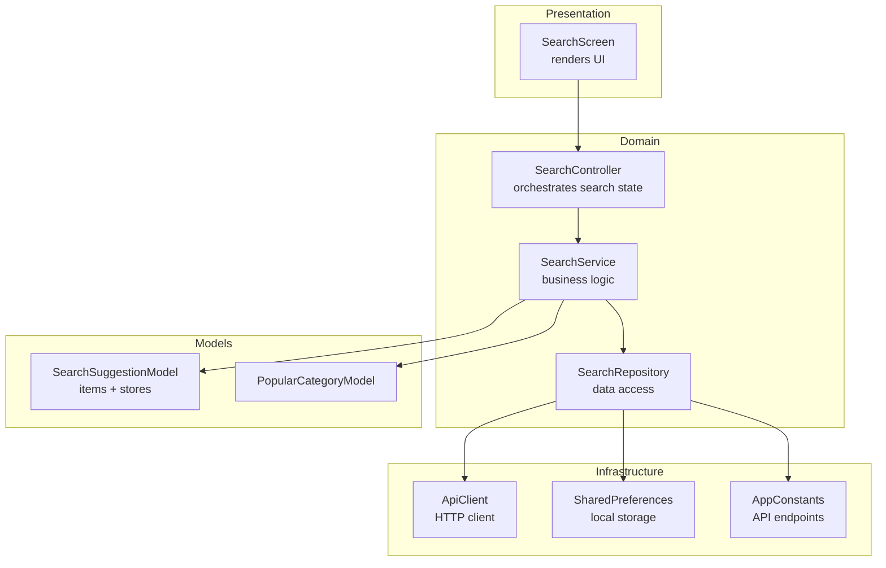
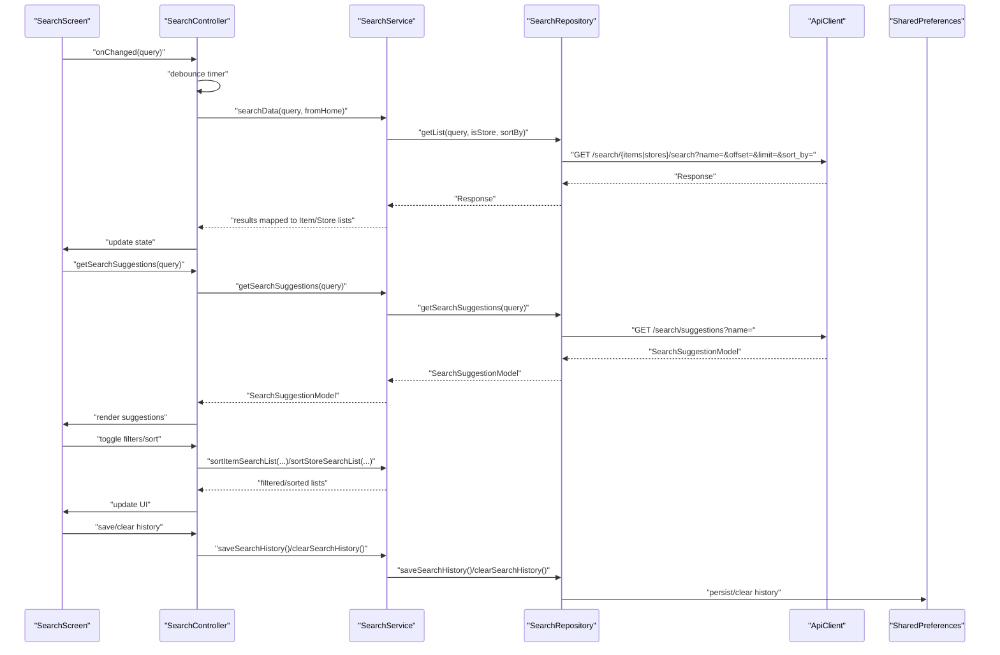
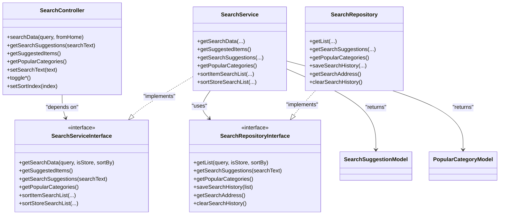

# Product Search

<cite>
**Referenced Files in This Document**
- [search_controller.dart](file://lib/features/search/controllers/search_controller.dart)
- [search_service.dart](file://lib/features/search/domain/services/search_service.dart)
- [search_service_interface.dart](file://lib/features/search/domain/services/search_service_interface.dart)
- [search_repository.dart](file://lib/features/search/domain/repositories/search_repository.dart)
- [search_repository_interface.dart](file://lib/features/search/domain/repositories/search_repository_interface.dart)
- [search_suggestion_model.dart](file://lib/features/search/domain/models/search_suggestion_model.dart)
- [popular_categories_model.dart](file://lib/features/search/domain/models/popular_categories_model.dart)
- [search_screen.dart](file://lib/features/search/screens/search_screen.dart)
- [app_constants.dart](file://lib/util/app_constants.dart)
- [repository_interface.dart](file://lib/interfaces/repository_interface.dart)
</cite>

## Table of Contents
1. [Introduction](#introduction)
2. [Project Structure](#project-structure)
3. [Core Components](#core-components)
4. [Architecture Overview](#architecture-overview)
5. [Detailed Component Analysis](#detailed-component-analysis)
6. [Dependency Analysis](#dependency-analysis)
7. [Performance Considerations](#performance-considerations)
8. [Troubleshooting Guide](#troubleshooting-guide)
9. [Conclusion](#conclusion)
10. [Appendices](#appendices)

## Introduction
This document explains the product search functionality end-to-end. It covers how user queries are processed, how autocomplete suggestions are generated, how filters and sorting are applied, and how results are paginated. It also documents the search controller’s role in orchestrating search state, the repository/service interfaces for data access, and the models used for suggestions and popular categories. Finally, it outlines performance optimization strategies, caching approaches, and integration points with product catalogs and categories.

## Project Structure
The search feature is organized by domain layers and presentation:
- Controllers manage UI state and user interactions.
- Services encapsulate business logic and orchestrate repository calls.
- Repositories handle network/API calls and local persistence.
- Models define the shape of suggestion and category data.
- Screens render the UI and bind to controllers.

**Diagram sources**
- [search_screen.dart:1-475](file://lib/features/search/screens/search_screen.dart#L1-L475)
- [search_controller.dart:1-396](file://lib/features/search/controllers/search_controller.dart#L1-L396)
- [search_service.dart:1-152](file://lib/features/search/domain/services/search_service.dart#L1-L152)
- [search_repository.dart:1-100](file://lib/features/search/domain/repositories/search_repository.dart#L1-L100)
- [search_suggestion_model.dart:1-101](file://lib/features/search/domain/models/search_suggestion_model.dart#L1-L101)
- [popular_categories_model.dart:1-61](file://lib/features/search/domain/models/popular_categories_model.dart#L1-L61)
- [app_constants.dart:80-205](file://lib/util/app_constants.dart#L80-L205)

**Section sources**
- [search_screen.dart:1-475](file://lib/features/search/screens/search_screen.dart#L1-L475)
- [search_controller.dart:1-396](file://lib/features/search/controllers/search_controller.dart#L1-L396)
- [search_service.dart:1-152](file://lib/features/search/domain/services/search_service.dart#L1-L152)
- [search_repository.dart:1-100](file://lib/features/search/domain/repositories/search_repository.dart#L1-L100)
- [search_suggestion_model.dart:1-101](file://lib/features/search/domain/models/search_suggestion_model.dart#L1-L101)
- [popular_categories_model.dart:1-61](file://lib/features/search/domain/models/popular_categories_model.dart#L1-L61)
- [app_constants.dart:80-205](file://lib/util/app_constants.dart#L80-L205)

## Core Components
- SearchController: Manages search text, debounce timers, filters, sorting indices, suggestion retrieval, and history persistence. It delegates search execution to SearchService and updates UI via reactive bindings.
- SearchService: Implements client-side filtering and sorting for items and stores, and defers network calls to SearchRepository.
- SearchRepository: Performs HTTP requests to backend endpoints, persists search history locally, and returns typed models.
- Models: SearchSuggestionModel (items and stores) and PopularCategoryModel define suggestion and category data structures.
- SearchScreen: Presents the search UI, handles user input, displays suggestions, recent searches, and routes to results.

Key responsibilities:
- Query processing: Debounced search execution, history management, and toggling between item/store search modes.
- Autocomplete: Fetches suggestions combining items and stores.
- Filtering and ranking: Applies price range, rating, availability, discount, and vegetarian/non-vegetarian filters; sorts by multiple criteria.
- Pagination: Uses offset/limit parameters in search endpoints.

**Section sources**
- [search_controller.dart:1-396](file://lib/features/search/controllers/search_controller.dart#L1-L396)
- [search_service.dart:1-152](file://lib/features/search/domain/services/search_service.dart#L1-L152)
- [search_repository.dart:1-100](file://lib/features/search/domain/repositories/search_repository.dart#L1-L100)
- [search_suggestion_model.dart:1-101](file://lib/features/search/domain/models/search_suggestion_model.dart#L1-L101)
- [popular_categories_model.dart:1-61](file://lib/features/search/domain/models/popular_categories_model.dart#L1-L61)
- [search_screen.dart:1-475](file://lib/features/search/screens/search_screen.dart#L1-L475)

## Architecture Overview
The search feature follows a layered architecture:
- Presentation layer (SearchScreen) binds to SearchController.
- Domain layer (SearchController) coordinates business actions and state.
- Service layer (SearchService) applies filters/sorting and delegates data access.
- Repository layer (SearchRepository) handles API calls and local storage.
- Models define the data contract for suggestions and categories.

**Diagram sources**
- [search_screen.dart:65-74](file://lib/features/search/screens/search_screen.dart#L65-L74)
- [search_controller.dart:241-303](file://lib/features/search/controllers/search_controller.dart#L241-L303)
- [search_service.dart:14-37](file://lib/features/search/domain/services/search_service.dart#L14-L37)
- [search_repository.dart:46-70](file://lib/features/search/domain/repositories/search_repository.dart#L46-L70)
- [app_constants.dart:80-205](file://lib/util/app_constants.dart#L80-L205)

## Detailed Component Analysis

### SearchController
Responsibilities:
- Debounce search and suggestion requests to reduce network load.
- Manage search mode (search vs. history), text, and result lists.
- Toggle filters: rating thresholds, price range, availability, discount, and dietary preferences.
- Sort results using predefined sort indices and API-compatible sort keys.
- Persist and manage search history using shared preferences.
- Retrieve suggested items and popular categories.

Important behaviors:
- Debounce durations prevent excessive API calls during typing.
- Search mode resets filters and clears previous results when switching contexts.
- Sorting indices map to client-side and server-side sort parameters.

Concrete examples:
- Price range filter: set lower and upper bounds; applied before sorting.
- Rating filter: minimum rating threshold applied to items/stores.
- Dietary filters: toggle veg/non-veg; excludes items/stores accordingly.
- Sorting: choose among price-low-to-high, price-high-to-low, rating, popularity, newest, a_to_z, z_to_a.

**Section sources**
- [search_controller.dart:13-396](file://lib/features/search/controllers/search_controller.dart#L13-L396)

### SearchService
Responsibilities:
- Delegates search data retrieval to repository.
- Provides client-side filtering and sorting for items and stores.
- Exposes methods for retrieving suggestions and popular categories.

Filtering logic highlights:
- Items: price range, rating threshold, dietary filters, availability window, discount presence.
- Stores: rating threshold, dietary filters, open/active status, discount presence.
- Sorting: numeric and alphabetical ordering with multiple criteria.

**Section sources**
- [search_service.dart:1-152](file://lib/features/search/domain/services/search_service.dart#L1-L152)

### SearchRepository
Responsibilities:
- Persists search history to SharedPreferences.
- Retrieves suggested items and popular categories.
- Executes search queries against backend endpoints with pagination and optional sorting.

Endpoints used:
- Suggested items: GET suggested items endpoint.
- Popular categories: GET categories endpoint.
- Search suggestions: GET suggestions endpoint.
- Search: GET items or stores search endpoint with pagination and optional sort_by.

Pagination:
- Uses offset and limit parameters to page results.

**Section sources**
- [search_repository.dart:1-100](file://lib/features/search/domain/repositories/search_repository.dart#L1-L100)
- [app_constants.dart:80-205](file://lib/util/app_constants.dart#L80-L205)

### Models: SearchSuggestionModel and PopularCategoryModel
SearchSuggestionModel:
- Contains lists of items and stores returned by the suggestions endpoint.
- Each item includes identifiers, name, unit type, and image URLs.
- Each store includes identifiers, name, GST info, and logo URLs.

PopularCategoryModel:
- Represents category metadata including id, name, image, parent id, position, status, timestamps, priority, module id, featured flag, and full image URL.

These models enable unified suggestion rendering and category browsing experiences.

**Section sources**
- [search_suggestion_model.dart:1-101](file://lib/features/search/domain/models/search_suggestion_model.dart#L1-L101)
- [popular_categories_model.dart:1-61](file://lib/features/search/domain/models/popular_categories_model.dart#L1-L61)

### SearchScreen
Responsibilities:
- Renders the search field, suggestions list, recent searches, and popular categories.
- Integrates with SearchController for live suggestions and search execution.
- Handles navigation to search results and category pages.

User flows:
- Typing in the search field triggers debounced suggestions.
- Submitting the search executes a search query and navigates to results.
- Tapping a recent search re-executes that query.
- Tapping a category navigates to category-specific browsing.

**Section sources**
- [search_screen.dart:1-475](file://lib/features/search/screens/search_screen.dart#L1-L475)

## Dependency Analysis
The search feature exhibits clean separation of concerns:
- SearchController depends on SearchServiceInterface.
- SearchService implements SearchServiceInterface and depends on SearchRepositoryInterface.
- SearchRepository implements SearchRepositoryInterface and depends on ApiClient and SharedPreferences.
- Models are consumed by SearchService and rendered by SearchScreen.

**Diagram sources**
- [search_controller.dart:1-396](file://lib/features/search/controllers/search_controller.dart#L1-L396)
- [search_service_interface.dart:1-17](file://lib/features/search/domain/services/search_service_interface.dart#L1-L17)
- [search_service.dart:1-152](file://lib/features/search/domain/services/search_service.dart#L1-L152)
- [search_repository_interface.dart:1-13](file://lib/features/search/domain/repositories/search_repository_interface.dart#L1-L13)
- [search_repository.dart:1-100](file://lib/features/search/domain/repositories/search_repository.dart#L1-L100)
- [search_suggestion_model.dart:1-101](file://lib/features/search/domain/models/search_suggestion_model.dart#L1-L101)
- [popular_categories_model.dart:1-61](file://lib/features/search/domain/models/popular_categories_model.dart#L1-L61)

**Section sources**
- [search_controller.dart:1-396](file://lib/features/search/controllers/search_controller.dart#L1-L396)
- [search_service_interface.dart:1-17](file://lib/features/search/domain/services/search_service_interface.dart#L1-L17)
- [search_service.dart:1-152](file://lib/features/search/domain/services/search_service.dart#L1-L152)
- [search_repository_interface.dart:1-13](file://lib/features/search/domain/repositories/search_repository_interface.dart#L1-L13)
- [search_repository.dart:1-100](file://lib/features/search/domain/repositories/search_repository.dart#L1-L100)

## Performance Considerations
- Debouncing: Both search and suggestion requests are debounced to minimize redundant network calls.
- Client-side filtering and sorting: Applied after fetching results to avoid repeated server calls for small adjustments.
- Pagination: Implemented via offset and limit to constrain payload sizes.
- Local caching:
  - Search history stored in SharedPreferences for quick recall.
  - Suggested items and popular categories cached in memory after first fetch.
- Network efficiency:
  - Reuse of a single ApiClient instance.
  - Minimal JSON parsing by using typed models.

Recommendations:
- Introduce in-memory LRU cache for frequent search terms and suggestions.
- Add request coalescing to merge rapid successive requests for the same query.
- Consider preloading top categories and popular items on app startup.
- Implement result deduplication when combining item and store suggestions.

[No sources needed since this section provides general guidance]

## Troubleshooting Guide
Common issues and resolutions:
- Empty or stale suggestions:
  - Verify the suggestions endpoint returns data and the controller extracts names from items and stores.
  - Ensure debounce timer is not canceling legitimate requests.
- Incorrect sorting or filtering:
  - Confirm sortIndex maps to the intended API sort_by value.
  - Validate filter flags (rating, price range, dietary, availability, discount) are applied in the correct order.
- History not persisting:
  - Check SharedPreferences write/read operations and AppConstants key.
- Pagination gaps:
  - Ensure offset increments correctly and limit remains consistent across requests.
- UI not updating:
  - Confirm reactive updates are triggered after repository responses and model mapping.

**Section sources**
- [search_controller.dart:241-303](file://lib/features/search/controllers/search_controller.dart#L241-L303)
- [search_service.dart:39-90](file://lib/features/search/domain/services/search_service.dart#L39-L90)
- [search_repository.dart:16-28](file://lib/features/search/domain/repositories/search_repository.dart#L16-L28)

## Conclusion
The search feature integrates a responsive UI with robust client-side filtering and sorting, efficient debouncing, and local persistence. Its layered architecture cleanly separates concerns, enabling maintainability and extensibility. By leveraging pagination, caching, and coalesced requests, the system scales to large catalogs while maintaining a smooth user experience.

[No sources needed since this section summarizes without analyzing specific files]

## Appendices

### API Endpoints Used by SearchRepository
- Suggested items: GET suggested items endpoint.
- Popular categories: GET categories endpoint.
- Search suggestions: GET suggestions endpoint.
- Search items/stores: GET items or stores search endpoint with pagination and optional sort_by.

**Section sources**
- [search_repository.dart:54-70](file://lib/features/search/domain/repositories/search_repository.dart#L54-L70)
- [app_constants.dart:80-205](file://lib/util/app_constants.dart#L80-L205)

### Example Queries and Filters
- Basic search: query “milk”, isStore=false, offset=1, limit=50.
- Store search: query “bakery”, isStore=true, offset=1, limit=50.
- Sorted search: add sort_by parameter (e.g., price_low_to_high).
- Filtered search: apply price range, rating threshold, dietary preferences, availability, and discount flags via client-side filtering.

**Section sources**
- [search_repository.dart:64-69](file://lib/features/search/domain/repositories/search_repository.dart#L64-L69)
- [search_service.dart:39-90](file://lib/features/search/domain/services/search_service.dart#L39-L90)

### Offline Capabilities
- Search history is persisted locally and restored on app start.
- Suggested items and popular categories can be cached in memory for immediate UI rendering.

**Section sources**
- [search_repository.dart:16-28](file://lib/features/search/domain/repositories/search_repository.dart#L16-L28)
- [search_controller.dart:390-394](file://lib/features/search/controllers/search_controller.dart#L390-L394)