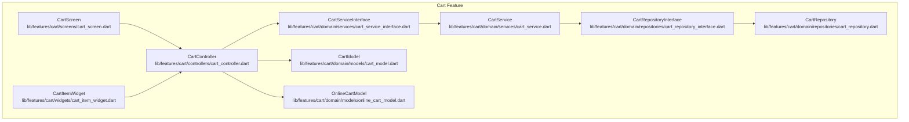
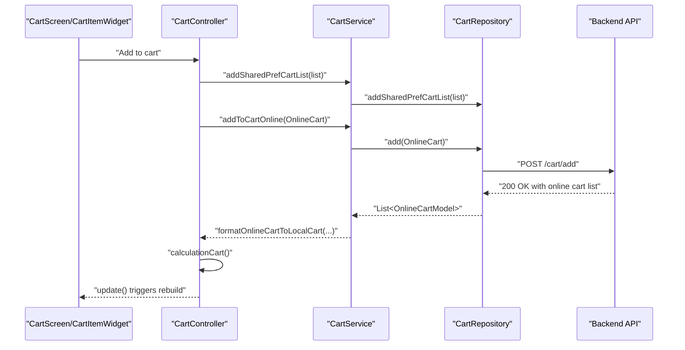
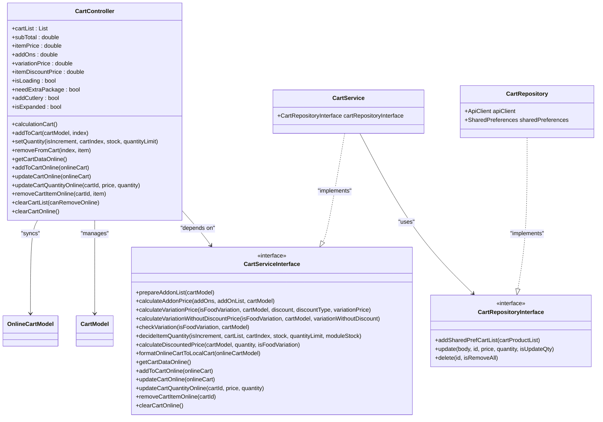

# Shopping Cart Management

<cite>
**Referenced Files in This Document**
- [cart_controller.dart](file://lib/features/cart/controllers/cart_controller.dart)
- [cart_model.dart](file://lib/features/cart/domain/models/cart_model.dart)
- [online_cart_model.dart](file://lib/features/cart/domain/models/online_cart_model.dart)
- [cart_service_interface.dart](file://lib/features/cart/domain/services/cart_service_interface.dart)
- [cart_service.dart](file://lib/features/cart/domain/services/cart_service.dart)
- [cart_repository_interface.dart](file://lib/features/cart/domain/repositories/cart_repository_interface.dart)
- [cart_repository.dart](file://lib/features/cart/domain/repositories/cart_repository.dart)
- [cart_screen.dart](file://lib/features/cart/screens/cart_screen.dart)
- [cart_item_widget.dart](file://lib/features/cart/widgets/cart_item_widget.dart)
- [app_constants.dart](file://lib/util/app_constants.dart)
</cite>

## Table of Contents
1. [Introduction](#introduction)
2. [Project Structure](#project-structure)
3. [Core Components](#core-components)
4. [Architecture Overview](#architecture-overview)
5. [Detailed Component Analysis](#detailed-component-analysis)
6. [Dependency Analysis](#dependency-analysis)
7. [Performance Considerations](#performance-considerations)
8. [Troubleshooting Guide](#troubleshooting-guide)
9. [Conclusion](#conclusion)

## Introduction
This document explains the shopping cart management system implemented in the Flutter/Dart application. It covers cart persistence mechanisms, item addition/removal operations, quantity management, state management in the controller, synchronization with backend services, and local storage integration. It also documents the cart model structure, pricing calculations, discount applications, the repository’s data access patterns, and the service’s business logic. Practical examples illustrate cart manipulation, bulk operations, and restoration. Integration points with product catalogs, user sessions, and order processing are described, along with cart expiration policies, inventory validation, and concurrent access handling for multi-device scenarios.

## Project Structure
The cart subsystem is organized by feature with clear separation of concerns:
- Controllers manage UI state and orchestrate cart operations.
- Domain models define cart and online cart structures.
- Services encapsulate business logic and coordinate with repositories.
- Repositories handle local and remote data access.
- Screens and widgets render the cart UI and collect user actions.

**Diagram sources**
- [cart_controller.dart:16-444](file://lib/features/cart/controllers/cart_controller.dart#L16-L444)
- [cart_service_interface.dart:7-73](file://lib/features/cart/domain/services/cart_service_interface.dart#L7-L73)
- [cart_service.dart:15-530](file://lib/features/cart/domain/services/cart_service.dart#L15-L530)
- [cart_repository_interface.dart:4-10](file://lib/features/cart/domain/repositories/cart_repository_interface.dart#L4-L10)
- [cart_repository.dart:13-145](file://lib/features/cart/domain/repositories/cart_repository.dart#L13-L145)
- [cart_model.dart:3-159](file://lib/features/cart/domain/models/cart_model.dart#L3-L159)
- [online_cart_model.dart:3-127](file://lib/features/cart/domain/models/online_cart_model.dart#L3-L127)
- [cart_screen.dart:40-1732](file://lib/features/cart/screens/cart_screen.dart#L40-L1732)
- [cart_item_widget.dart:18-508](file://lib/features/cart/widgets/cart_item_widget.dart#L18-L508)

**Section sources**
- [cart_controller.dart:16-444](file://lib/features/cart/controllers/cart_controller.dart#L16-L444)
- [cart_service.dart:15-530](file://lib/features/cart/domain/services/cart_service.dart#L15-L530)
- [cart_repository.dart:13-145](file://lib/features/cart/domain/repositories/cart_repository.dart#L13-L145)
- [cart_model.dart:3-159](file://lib/features/cart/domain/models/cart_model.dart#L3-L159)
- [online_cart_model.dart:3-127](file://lib/features/cart/domain/models/online_cart_model.dart#L3-L127)
- [cart_screen.dart:40-1732](file://lib/features/cart/screens/cart_screen.dart#L40-L1732)
- [cart_item_widget.dart:18-508](file://lib/features/cart/widgets/cart_item_widget.dart#L18-L508)

## Core Components
- CartController: Manages cart state, exposes getters for totals and flags, coordinates UI updates, and delegates business logic to CartServiceInterface. Handles local and online cart operations, availability checks, and UI toggles (extra packaging, cutlery).
- CartServiceInterface/CartService: Defines and implements business logic for pricing, discounts, quantities, addons, variations, and online cart synchronization. Delegates repository calls via CartRepositoryInterface.
- CartRepositoryInterface/CartRepository: Encapsulates local shared preferences persistence and remote API interactions for cart CRUD operations and synchronization.
- CartModel/OnlineCartModel: Define the cart item structure locally and remotely, including item associations, pricing, addons, variations, and stock limits.
- CartScreen/CartItemWidget: Render the cart UI, handle user interactions (add/remove/update quantity), and integrate with checkout and suggestions.

Key responsibilities:
- Persistence: Local shared preferences for module-scoped cart entries; remote API for synchronized cart state.
- Pricing: Calculates item price, addons, variations, and discounts with support for module-specific configurations.
- Synchronization: Adds, updates, removes, and clears online cart entries; refreshes local state after remote changes.
- Validation: Enforces stock limits and quantity caps; handles availability windows.

**Section sources**
- [cart_controller.dart:16-444](file://lib/features/cart/controllers/cart_controller.dart#L16-L444)
- [cart_service_interface.dart:7-73](file://lib/features/cart/domain/services/cart_service_interface.dart#L7-L73)
- [cart_service.dart:15-530](file://lib/features/cart/domain/services/cart_service.dart#L15-L530)
- [cart_repository_interface.dart:4-10](file://lib/features/cart/domain/repositories/cart_repository_interface.dart#L4-L10)
- [cart_repository.dart:13-145](file://lib/features/cart/domain/repositories/cart_repository.dart#L13-L145)
- [cart_model.dart:3-159](file://lib/features/cart/domain/models/cart_model.dart#L3-L159)
- [online_cart_model.dart:3-127](file://lib/features/cart/domain/models/online_cart_model.dart#L3-L127)
- [cart_screen.dart:40-1732](file://lib/features/cart/screens/cart_screen.dart#L40-L1732)
- [cart_item_widget.dart:18-508](file://lib/features/cart/widgets/cart_item_widget.dart#L18-L508)

## Architecture Overview
The cart system follows a layered architecture:
- Presentation Layer: CartScreen and CartItemWidget trigger actions and render state.
- Controller Layer: CartController orchestrates UI state and calls CartServiceInterface methods.
- Service Layer: CartService implements business rules and delegates to CartRepositoryInterface.
- Repository Layer: CartRepository manages local shared preferences and remote API calls.
- Data Models: CartModel and OnlineCartModel represent cart data locally and remotely.

**Diagram sources**
- [cart_controller.dart:199-214](file://lib/features/cart/controllers/cart_controller.dart#L199-L214)
- [cart_controller.dart:319-339](file://lib/features/cart/controllers/cart_controller.dart#L319-L339)
- [cart_service.dart:19-22](file://lib/features/cart/domain/services/cart_service.dart#L19-L22)
- [cart_repository.dart:42-54](file://lib/features/cart/domain/repositories/cart_repository.dart#L42-L54)
- [cart_service.dart:348-451](file://lib/features/cart/domain/services/cart_service.dart#L348-L451)
- [cart_controller.dart:113-197](file://lib/features/cart/controllers/cart_controller.dart#L113-L197)

**Section sources**
- [cart_controller.dart:199-339](file://lib/features/cart/controllers/cart_controller.dart#L199-L339)
- [cart_service.dart:19-47](file://lib/features/cart/domain/services/cart_service.dart#L19-L47)
- [cart_repository.dart:42-144](file://lib/features/cart/domain/repositories/cart_repository.dart#L42-L144)

## Detailed Component Analysis

### CartController
Responsibilities:
- Maintains cart list and derived totals (item price, addons, variations, discount price, subtotal).
- Manages UI flags: loading, extra package, cutlery, expansion state, availability lists.
- Coordinates item addition, removal, quantity updates, and online synchronization.
- Integrates with ItemController and SplashController for state and module configuration.

Key methods:
- addToCart: Adds or replaces a cart item, persists to shared preferences, recalculates totals, and notifies UI.
- setQuantity: Increments/decrements quantity with stock and limit validation, updates online cart, and refreshes local state.
- removeFromCart: Removes item from cart and synchronizes deletion online.
- getCartDataOnline/addToCartOnline/updateCartOnline: Fetches, adds, and updates online cart, then refreshes local state.
- clearCartList/clearCartOnline: Clears local and online cart depending on session and module context.
- calculationCart: Computes totals considering addons, variations, and discounts.

Concurrency and multi-device:
- Uses online cart synchronization to reconcile state across devices.
- Applies isLoading flags during async operations to prevent race conditions.

**Section sources**
- [cart_controller.dart:16-444](file://lib/features/cart/controllers/cart_controller.dart#L16-L444)

### CartServiceInterface and CartService
Responsibilities:
- Implements pricing logic for addons, variations, and discounts.
- Validates quantities against stock and per-item quantity limits.
- Formats online cart responses into local CartModel instances.
- Provides module-aware behavior for food vs. product variations.

Key methods:
- prepareAddonList/calculateAddonPrice: Builds addon lists and computes addon prices.
- calculateVariationPrice/calculateVariationWithoutDiscountPrice/checkVariation: Computes variation prices and detects presence of variations.
- decideItemQuantity: Enforces stock and quantity limit rules.
- calculateDiscountedPrice: Computes discounted price for items and variations.
- formatOnlineCartToLocalCart: Converts OnlineCartModel to CartModel with proper addons, variations, and quantities.
- Online cart operations: addToCartOnline, updateCartOnline, updateCartQuantityOnline, getCartDataOnline, removeCartItemOnline, clearCartOnline.

**Section sources**
- [cart_service_interface.dart:7-73](file://lib/features/cart/domain/services/cart_service_interface.dart#L7-L73)
- [cart_service.dart:15-530](file://lib/features/cart/domain/services/cart_service.dart#L15-L530)

### CartRepositoryInterface and CartRepository
Responsibilities:
- Local persistence: addSharedPrefCartList writes module-scoped cart entries to shared preferences.
- Remote operations: add, update, delete, and getList for online cart synchronization.
- Authentication and headers: Attaches token and module context for authenticated requests.

Endpoints and behaviors:
- add: POST /cart/add
- update: POST /cart/update (supports quantity updates)
- delete: DELETE /cart/remove-item or DELETE /cart/remove-all
- getList: GET /cart/list with Authorization and module headers

**Section sources**
- [cart_repository_interface.dart:4-10](file://lib/features/cart/domain/repositories/cart_repository_interface.dart#L4-L10)
- [cart_repository.dart:13-145](file://lib/features/cart/domain/repositories/cart_repository.dart#L13-L145)
- [app_constants.dart](file://lib/util/app_constants.dart)

### CartModel and OnlineCartModel
CartModel (local):
- Fields include id, price, discountedPrice, variation, foodVariations, discountAmount, quantity, addOnIds, addOns, isCampaign, stock, item, quantityLimit, and isLoading.
- Supports JSON serialization/deserialization for shared preferences and network transport.

OnlineCartModel (remote):
- Fields include id, userId, moduleId, itemId, isGuest, addOnIds/addOnQtys, itemType, price, quantity, foodVariation/productVariation, timestamps, and item.
- Distinguishes between foodVariation and productVariation to support module-specific variation types.

**Section sources**
- [cart_model.dart:3-159](file://lib/features/cart/domain/models/cart_model.dart#L3-L159)
- [online_cart_model.dart:3-127](file://lib/features/cart/domain/models/online_cart_model.dart#L3-L127)

### CartScreen and CartItemWidget
CartScreen:
- Initializes cart state, loads online cart if local is empty, sets UI defaults (extra packaging, cutlery), and renders order summary and suggestions.
- Navigates to checkout after validating availability and module configuration.

CartItemWidget:
- Renders item image, name, price (with savings), addons/variations, and quantity controls.
- Handles sliding actions to remove items and opens item details for editing.

**Section sources**
- [cart_screen.dart:40-1732](file://lib/features/cart/screens/cart_screen.dart#L40-L1732)
- [cart_item_widget.dart:18-508](file://lib/features/cart/widgets/cart_item_widget.dart#L18-L508)

## Dependency Analysis

**Diagram sources**
- [cart_controller.dart:16-444](file://lib/features/cart/controllers/cart_controller.dart#L16-L444)
- [cart_service_interface.dart:7-73](file://lib/features/cart/domain/services/cart_service_interface.dart#L7-L73)
- [cart_service.dart:15-530](file://lib/features/cart/domain/services/cart_service.dart#L15-L530)
- [cart_repository_interface.dart:4-10](file://lib/features/cart/domain/repositories/cart_repository_interface.dart#L4-L10)
- [cart_repository.dart:13-145](file://lib/features/cart/domain/repositories/cart_repository.dart#L13-L145)
- [cart_model.dart:3-159](file://lib/features/cart/domain/models/cart_model.dart#L3-L159)
- [online_cart_model.dart:3-127](file://lib/features/cart/domain/models/online_cart_model.dart#L3-L127)

**Section sources**
- [cart_controller.dart:16-444](file://lib/features/cart/controllers/cart_controller.dart#L16-L444)
- [cart_service.dart:15-530](file://lib/features/cart/domain/services/cart_service.dart#L15-L530)
- [cart_repository.dart:13-145](file://lib/features/cart/domain/repositories/cart_repository.dart#L13-L145)

## Performance Considerations
- Minimize UI rebuilds: Use GetBuilder selectively and avoid unnecessary updates.
- Batch operations: Prefer online synchronization for bulk changes to reduce repeated local writes.
- Efficient calculations: Keep pricing computations in CartService to avoid duplicating logic across UI components.
- Debounce user inputs: Limit rapid-fire quantity updates to reduce network calls.
- Lazy loading: Load suggestions and store details only when cart is non-empty.

## Troubleshooting Guide
Common issues and resolutions:
- Out-of-stock errors: The service enforces stock limits and displays localized snackbars when quantity cannot be increased.
- Quantity limit exceeded: Snackbars inform users of maximum allowed quantity per item.
- Availability validation: Items outside available time windows are marked unavailable; UI shows appropriate messaging.
- Online sync failures: Ensure authentication token and module headers are present; retry failed operations and refresh local state.
- Local persistence conflicts: Module-scoped cart entries are filtered by module ID to prevent cross-module contamination.

Operational checks:
- Verify API endpoints and headers in CartRepository.
- Confirm CartService formatting aligns with backend responses.
- Validate UI state transitions using isLoading flags.

**Section sources**
- [cart_service.dart:253-278](file://lib/features/cart/domain/services/cart_service.dart#L253-L278)
- [cart_repository.dart:85-115](file://lib/features/cart/domain/repositories/cart_repository.dart#L85-L115)
- [cart_item_widget.dart:123-132](file://lib/features/cart/widgets/cart_item_widget.dart#L123-L132)

## Conclusion
The cart management system integrates local and remote cart persistence with robust business logic for pricing, discounts, and inventory validation. CartController centralizes state and UI coordination, while CartService and CartRepository encapsulate business rules and data access. The architecture supports multi-device synchronization, availability checks, and user-driven modifications. By following the documented patterns and troubleshooting steps, developers can extend and maintain the cart functionality effectively.