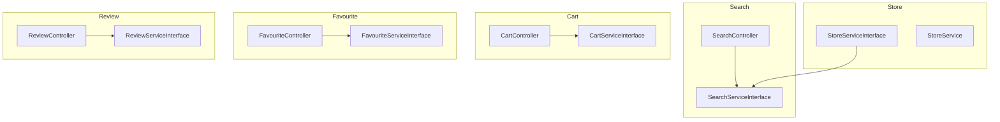
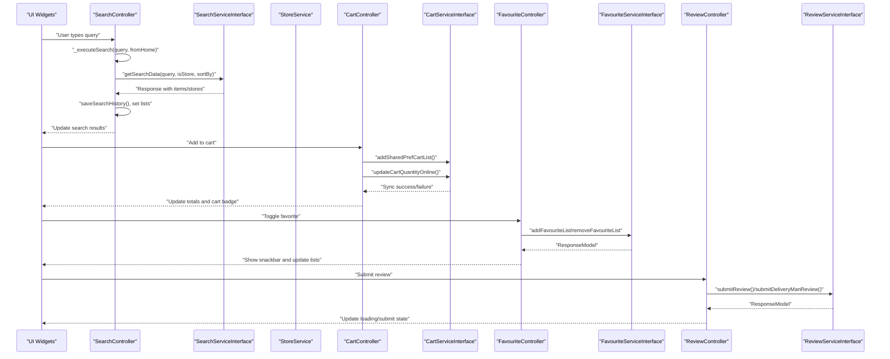
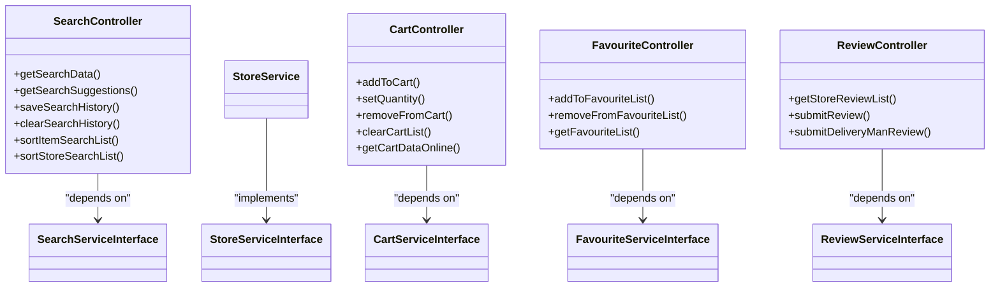

# Shopping Experience

<cite>
**Referenced Files in This Document**
- [cart_controller.dart](file://lib/features/cart/controllers/cart_controller.dart)
- [cart_service_interface.dart](file://lib/features/cart/domain/services/cart_service_interface.dart)
- [search_controller.dart](file://lib/features/search/controllers/search_controller.dart)
- [search_service_interface.dart](file://lib/features/search/domain/services/search_service_interface.dart)
- [favourite_controller.dart](file://lib/features/favourite/controllers/favourite_controller.dart)
- [favourite_service_interface.dart](file://lib/features/favourite/domain/services/favourite_service_interface.dart)
- [review_controller.dart](file://lib/features/review/controllers/review_controller.dart)
- [review_service_interface.dart](file://lib/features/review/domain/services/review_service_interface.dart)
- [store_service_interface.dart](file://lib/features/store/domain/services/store_service_interface.dart)
- [store_service.dart](file://lib/features/store/domain/services/store_service.dart)
- [grocery_improvements_plan.md](file://grocery_improvements_plan.md)
- [store_screen.dart](file://lib/features/store/screens/store_screen.dart)
- [store_item_search_screen.dart](file://lib/features/store/screens/store_item_search_screen.dart)
- [fav_item_view_widget.dart](file://lib/features/favourite/widgets/fav_item_view_widget.dart)
- [item_view_widget.dart](file://lib/features/search/widgets/item_view_widget.dart)
- [item_bottom_sheet.dart](file://lib/common/widgets/item_bottom_sheet.dart)
- [store_description_view_widget.dart](file://lib/features/store/widgets/store_description_view_widget.dart)
</cite>

## Table of Contents
1. [Introduction](#introduction)
2. [Project Structure](#project-structure)
3. [Core Components](#core-components)
4. [Architecture Overview](#architecture-overview)
5. [Detailed Component Analysis](#detailed-component-analysis)
6. [Dependency Analysis](#dependency-analysis)
7. [Performance Considerations](#performance-considerations)
8. [Troubleshooting Guide](#troubleshooting-guide)
9. [Conclusion](#conclusion)
10. [Appendices](#appendices)

## Introduction
This document explains the shopping experience components of the application, focusing on product browsing, search and discovery, cart management, favorites/wishlist, and reviews/ratings. It documents the controllers and services orchestrating user shopping interactions, data synchronization, and state management. It also outlines search algorithm characteristics, filtering mechanisms, cart persistence, and review submission flows, along with configuration options and backend integration points. Practical examples are referenced from the codebase to illustrate search queries, cart operations, and review submissions.

## Project Structure
The shopping experience spans several feature modules:
- Search: Controllers and services for search queries, suggestions, and filtering
- Store: Services for store details, item lists, and recommended items
- Cart: Controllers and services for adding/removing items, quantity updates, and online synchronization
- Favourite: Controllers and services for favorites/wishlist management
- Review: Controllers and services for retrieving and submitting reviews

**Diagram sources**
- [search_controller.dart:1-396](file://lib/features/search/controllers/search_controller.dart#L1-L396)
- [search_service_interface.dart:1-17](file://lib/features/search/domain/services/search_service_interface.dart#L1-L17)
- [store_service_interface.dart:11-24](file://lib/features/store/domain/services/store_service_interface.dart#L11-L24)
- [store_service.dart:51-71](file://lib/features/store/domain/services/store_service.dart#L51-L71)
- [cart_controller.dart:16-444](file://lib/features/cart/controllers/cart_controller.dart#L16-L444)
- [cart_service_interface.dart:1-73](file://lib/features/cart/domain/services/cart_service_interface.dart#L1-L73)
- [favourite_controller.dart:10-162](file://lib/features/favourite/controllers/favourite_controller.dart#L10-L162)
- [favourite_service_interface.dart:1-14](file://lib/features/favourite/domain/services/favourite_service_interface.dart#L1-L14)
- [review_controller.dart:9-101](file://lib/features/review/controllers/review_controller.dart#L9-L101)
- [review_service_interface.dart:1-9](file://lib/features/review/domain/services/review_service_interface.dart#L1-L9)

**Section sources**
- [search_controller.dart:1-396](file://lib/features/search/controllers/search_controller.dart#L1-L396)
- [cart_controller.dart:16-444](file://lib/features/cart/controllers/cart_controller.dart#L16-L444)
- [favourite_controller.dart:10-162](file://lib/features/favourite/controllers/favourite_controller.dart#L10-L162)
- [review_controller.dart:9-101](file://lib/features/review/controllers/review_controller.dart#L9-L101)

## Core Components
- SearchController: Manages search queries, debounced execution, suggestions, history, and client-side filtering/sorting
- CartController: Handles cart lifecycle, quantity adjustments, online synchronization, and totals calculation
- FavouriteController: Manages favorites for items and stores, with optimistic UI updates and rollback on failure
- ReviewController: Manages retrieval and submission of store and delivery reviews, with per-item state arrays

Key responsibilities:
- Search: Debounce timers, search suggestions, sort parameters, and client-side filters
- Cart: Local and online cart sync, item availability checks, add-ons and variations pricing
- Favourite: Optimistic add/remove with server-backed reconciliation
- Review: Per-order item review state and delivery man review submission

**Section sources**
- [search_controller.dart:13-396](file://lib/features/search/controllers/search_controller.dart#L13-L396)
- [cart_controller.dart:16-444](file://lib/features/cart/controllers/cart_controller.dart#L16-L444)
- [favourite_controller.dart:10-162](file://lib/features/favourite/controllers/favourite_controller.dart#L10-L162)
- [review_controller.dart:9-101](file://lib/features/review/controllers/review_controller.dart#L9-L101)

## Architecture Overview
The shopping experience follows a layered architecture:
- UI widgets observe controllers via reactive state updates
- Controllers depend on service interfaces for data operations
- Services encapsulate business logic and coordinate with repositories/API clients
- Store services integrate with search services for store-specific item listings and search

**Diagram sources**
- [search_controller.dart:241-303](file://lib/features/search/controllers/search_controller.dart#L241-L303)
- [search_service_interface.dart:8](file://lib/features/search/domain/services/search_service_interface.dart#L8)
- [store_service.dart:51-71](file://lib/features/store/domain/services/store_service.dart#L51-L71)
- [cart_controller.dart:199-214](file://lib/features/cart/controllers/cart_controller.dart#L199-L214)
- [cart_controller.dart:363-402](file://lib/features/cart/controllers/cart_controller.dart#L363-L402)
- [favourite_controller.dart:29-62](file://lib/features/favourite/controllers/favourite_controller.dart#L29-L62)
- [favourite_service_interface.dart:7-9](file://lib/features/favourite/domain/services/favourite_service_interface.dart#L7-L9)
- [review_controller.dart:75-99](file://lib/features/review/controllers/review_controller.dart#L75-L99)
- [review_service_interface.dart:6-9](file://lib/features/review/domain/services/review_service_interface.dart#L6-L9)

## Detailed Component Analysis

### Search and Discovery
- Debounced search: SearchController uses a timer to delay API calls until the user pauses typing, reducing network load
- Suggestions: Debounced suggestion fetching aggregates item and store names into a flat list for autocomplete
- Sorting: Provides sort options and maps selected index to backend sort parameters where supported
- Filtering: Maintains client-side filters for price range, rating, availability, discounts, and dietary preferences
- History: Persists and clears search history via service interface

Concrete examples from the codebase:
- Debounced search execution: [search_controller.dart:241-303](file://lib/features/search/controllers/search_controller.dart#L241-L303)
- Debounced suggestions: [search_controller.dart:371-388](file://lib/features/search/controllers/search_controller.dart#L371-L388)
- Sort mapping and client-side fallbacks: [search_controller.dart:58-89](file://lib/features/search/controllers/search_controller.dart#L58-L89)
- Client-side filtering and sorting: [search_service_interface.dart:13-14](file://lib/features/search/domain/services/search_service_interface.dart#L13-L14)

Backend enhancement roadmap (planned):
- Server-side sorting parameters (price, rating, popularity, distance, newest)
- Server-side filtering (min/max price, rating, dietary flags, availability, discounts)
- See: [grocery_improvements_plan.md:49-84](file://grocery_improvements_plan.md#L49-L84)

**Section sources**
- [search_controller.dart:13-396](file://lib/features/search/controllers/search_controller.dart#L13-L396)
- [search_service_interface.dart:1-17](file://lib/features/search/domain/services/search_service_interface.dart#L1-L17)
- [grocery_improvements_plan.md:49-84](file://grocery_improvements_plan.md#L49-L84)

### Product Browsing and Store Integration
- Store services expose methods for store details, item lists, search within a store, and recommended items
- Store search screen integrates with store controller to initialize search data
- Store description and wish list toggling are integrated in store UI components

Concrete examples from the codebase:
- Store item list retrieval: [store_service_interface.dart:18-21](file://lib/features/store/domain/services/store_service_interface.dart#L18-L21)
- Store search item list: [store_service_interface.dart:20](file://lib/features/store/domain/services/store_service_interface.dart#L20)
- Store recommended items: [store_service_interface.dart:21](file://lib/features/store/domain/services/store_service_interface.dart#L21)
- Store controller initialization in store search screen: [store_item_search_screen.dart:26-31](file://lib/features/store/screens/store_item_search_screen.dart#L26-L31)
- Store cart badge rendering: [store_screen.dart:451-476](file://lib/features/store/screens/store_screen.dart#L451-L476)

**Section sources**
- [store_service_interface.dart:11-24](file://lib/features/store/domain/services/store_service_interface.dart#L11-L24)
- [store_service.dart:51-71](file://lib/features/store/domain/services/store_service.dart#L51-L71)
- [store_item_search_screen.dart:26-31](file://lib/features/store/screens/store_item_search_screen.dart#L26-L31)
- [store_screen.dart:451-476](file://lib/features/store/screens/store_screen.dart#L451-L476)

### Shopping Cart Management
- Local state: CartController maintains cart items, quantities, totals, and availability flags
- Persistence: Adds to shared preferences via CartServiceInterface
- Online sync: Supports add, update, remove, and clear operations against online cart
- Totals calculation: Computes item price, discount price, add-ons, and variations considering module configurations

Concrete examples from the codebase:
- Add to cart and persist: [cart_controller.dart:199-214](file://lib/features/cart/controllers/cart_controller.dart#L199-L214)
- Quantity update with online sync: [cart_controller.dart:220-262](file://lib/features/cart/controllers/cart_controller.dart#L220-L262)
- Remove from cart and online removal: [cart_controller.dart:264-273](file://lib/features/cart/controllers/cart_controller.dart#L264-L273)
- Clear cart (online when applicable): [cart_controller.dart:275-283](file://lib/features/cart/controllers/cart_controller.dart#L275-L283)
- Online cart refresh and recalculation: [cart_controller.dart:384-402](file://lib/features/cart/controllers/cart_controller.dart#L384-L402)
- Cart quantity and variant helpers: [cart_controller.dart:431-437](file://lib/features/cart/controllers/cart_controller.dart#L431-L437)

Cart persistence and state management:
- Local storage integration via CartServiceInterface methods for shared preferences
- Reactive UI updates through Get.update()

**Section sources**
- [cart_controller.dart:16-444](file://lib/features/cart/controllers/cart_controller.dart#L16-L444)
- [cart_service_interface.dart:1-73](file://lib/features/cart/domain/services/cart_service_interface.dart#L1-L73)

### Wishlist and Favorites
- FavouriteController manages item and store favorites, maintaining ID lists and optimistic UI updates
- On failure, reverts UI changes and shows feedback via snackbars
- Retrieves and filters favorites based on module context

Concrete examples from the codebase:
- Add to favorites: [favourite_controller.dart:29-62](file://lib/features/favourite/controllers/favourite_controller.dart#L29-L62)
- Remove from favorites: [favourite_controller.dart:64-105](file://lib/features/favourite/controllers/favourite_controller.dart#L64-L105)
- Load favorites with module-aware filtering: [favourite_controller.dart:107-154](file://lib/features/favourite/controllers/favourite_controller.dart#L107-L154)
- Wishlist UI integration (store and item views): [fav_item_view_widget.dart:25-57](file://lib/features/favourite/widgets/fav_item_view_widget.dart#L25-L57)

**Section sources**
- [favourite_controller.dart:10-162](file://lib/features/favourite/controllers/favourite_controller.dart#L10-L162)
- [favourite_service_interface.dart:1-14](file://lib/features/favourite/domain/services/favourite_service_interface.dart#L1-L14)
- [fav_item_view_widget.dart:25-57](file://lib/features/favourite/widgets/fav_item_view_widget.dart#L25-L57)

### Reviews and Ratings
- ReviewController manages per-order item review state (ratings and comments) and delivery man reviews
- Supports fetching store review lists and submitting reviews with loading and success states

Concrete examples from the codebase:
- Initialize review state for order items: [review_controller.dart:44-59](file://lib/features/review/controllers/review_controller.dart#L44-L59)
- Submit item review: [review_controller.dart:75-86](file://lib/features/review/controllers/review_controller.dart#L75-L86)
- Submit delivery man review: [review_controller.dart:88-99](file://lib/features/review/controllers/review_controller.dart#L88-L99)
- Retrieve store reviews: [review_controller.dart:34-42](file://lib/features/review/controllers/review_controller.dart#L34-L42)

**Section sources**
- [review_controller.dart:9-101](file://lib/features/review/controllers/review_controller.dart#L9-L101)
- [review_service_interface.dart:1-9](file://lib/features/review/domain/services/review_service_interface.dart#L1-L9)

### UI Integration Points
- Search results view: [item_view_widget.dart:10-33](file://lib/features/search/widgets/item_view_widget.dart#L10-L33)
- Store description and wish toggle: [store_description_view_widget.dart:89-110](file://lib/features/store/widgets/store_description_view_widget.dart#L89-L110)
- Item bottom sheet favorite toggle: [item_bottom_sheet.dart:450-468](file://lib/common/widgets/item_bottom_sheet.dart#L450-L468)

**Section sources**
- [item_view_widget.dart:10-33](file://lib/features/search/widgets/item_view_widget.dart#L10-L33)
- [store_description_view_widget.dart:89-110](file://lib/features/store/widgets/store_description_view_widget.dart#L89-L110)
- [item_bottom_sheet.dart:450-468](file://lib/common/widgets/item_bottom_sheet.dart#L450-L468)

## Dependency Analysis
Controllers depend on service interfaces, which decouple UI from data sources. StoreService composes StoreRepositoryInterface to provide store-centric operations, while SearchServiceInterface coordinates search data retrieval and filtering.

**Diagram sources**
- [search_controller.dart:9-11](file://lib/features/search/controllers/search_controller.dart#L9-L11)
- [search_service_interface.dart:7](file://lib/features/search/domain/services/search_service_interface.dart#L7)
- [store_service_interface.dart:11](file://lib/features/store/domain/services/store_service_interface.dart#L11)
- [store_service.dart:51-71](file://lib/features/store/domain/services/store_service.dart#L51-L71)
- [cart_controller.dart:17](file://lib/features/cart/controllers/cart_controller.dart#L17)
- [cart_service_interface.dart:7](file://lib/features/cart/domain/services/cart_service_interface.dart#L7)
- [favourite_controller.dart:11](file://lib/features/favourite/controllers/favourite_controller.dart#L11)
- [favourite_service_interface.dart:6](file://lib/features/favourite/domain/services/favourite_service_interface.dart#L6)
- [review_controller.dart:11](file://lib/features/review/controllers/review_controller.dart#L11)
- [review_service_interface.dart:5](file://lib/features/review/domain/services/review_service_interface.dart#L5)

**Section sources**
- [search_controller.dart:9-11](file://lib/features/search/controllers/search_controller.dart#L9-L11)
- [cart_controller.dart:17](file://lib/features/cart/controllers/cart_controller.dart#L17)
- [favourite_controller.dart:11](file://lib/features/favourite/controllers/favourite_controller.dart#L11)
- [review_controller.dart:11](file://lib/features/review/controllers/review_controller.dart#L11)

## Performance Considerations
- Search debouncing: Implemented in SearchController to reduce API calls during typing
- Client-side filtering/sorting: Currently applied to fetched results; planned to move to backend for large catalogs
- Pagination and limits: StoreService methods accept offset and category filters; leverage pagination to avoid large payloads
- Offline capabilities: CartController supports local persistence and online sync; favorites and search history are persisted locally
- Caching strategies: Recommended to cache frequently accessed store/item lists and search suggestions with TTL and invalidation on changes

[No sources needed since this section provides general guidance]

## Troubleshooting Guide
- Search not updating: Verify debounce timer cancellation and _executeSearch conditions
  - References: [search_controller.dart:18-22](file://lib/features/search/controllers/search_controller.dart#L18-L22), [search_controller.dart:241-303](file://lib/features/search/controllers/search_controller.dart#L241-L303)
- Cart quantity not syncing: Ensure online update returns success and getCartDataOnline is called
  - References: [cart_controller.dart:363-402](file://lib/features/cart/controllers/cart_controller.dart#L363-L402), [cart_controller.dart:220-262](file://lib/features/cart/controllers/cart_controller.dart#L220-L262)
- Favorite toggle fails: Check optimistic UI revert logic and snackbar messages
  - References: [favourite_controller.dart:64-105](file://lib/features/favourite/controllers/favourite_controller.dart#L64-L105)
- Review submission stuck: Confirm loading state updates and response handling
  - References: [review_controller.dart:75-86](file://lib/features/review/controllers/review_controller.dart#L75-L86), [review_controller.dart:88-99](file://lib/features/review/controllers/review_controller.dart#L88-L99)

**Section sources**
- [search_controller.dart:18-22](file://lib/features/search/controllers/search_controller.dart#L18-L22)
- [search_controller.dart:241-303](file://lib/features/search/controllers/search_controller.dart#L241-L303)
- [cart_controller.dart:363-402](file://lib/features/cart/controllers/cart_controller.dart#L363-L402)
- [cart_controller.dart:220-262](file://lib/features/cart/controllers/cart_controller.dart#L220-L262)
- [favourite_controller.dart:64-105](file://lib/features/favourite/controllers/favourite_controller.dart#L64-L105)
- [review_controller.dart:75-86](file://lib/features/review/controllers/review_controller.dart#L75-L86)
- [review_controller.dart:88-99](file://lib/features/review/controllers/review_controller.dart#L88-L99)

## Conclusion
The shopping experience is structured around reactive controllers and service interfaces, enabling clear separation of concerns. Search and discovery benefit from debouncing and client-side filtering, with plans to offload sorting and filtering to the backend. Cart management balances local persistence with online synchronization, while favorites and reviews provide immediate user feedback with optimistic updates. The architecture supports scalability and maintainability, with opportunities to enhance performance and offline capabilities.

[No sources needed since this section summarizes without analyzing specific files]

## Appendices

### Configuration Options and Parameters
- Search
  - Debounce duration: 400 ms
  - Sort options: price_low_to_high, price_high_to_low, rating, popularity, newest, plus client-side a_to_z/z_to_a
  - Filters: price range, rating, availability, discounts, dietary preferences (veg/non-veg)
  - Backend roadmap: server-side sort_by and filter parameters
  - References: [search_controller.dart:13-15](file://lib/features/search/controllers/search_controller.dart#L13-L15), [search_controller.dart:58-89](file://lib/features/search/controllers/search_controller.dart#L58-L89), [search_controller.dart:100-122](file://lib/features/search/controllers/search_controller.dart#L100-L122), [grocery_improvements_plan.md:49-84](file://grocery_improvements_plan.md#L49-L84)
- Cart
  - Local persistence via shared preferences
  - Online sync for add/update/remove/clear
  - Totals computation considers add-ons, variations, and discounts
  - References: [cart_controller.dart:199-214](file://lib/features/cart/controllers/cart_controller.dart#L199-L214), [cart_controller.dart:363-402](file://lib/features/cart/controllers/cart_controller.dart#L363-L402)
- Wishlist/Favorites
  - Optimistic UI with rollback on failure
  - Module-aware filtering when module is set
  - References: [favourite_controller.dart:29-62](file://lib/features/favourite/controllers/favourite_controller.dart#L29-L62), [favourite_controller.dart:107-154](file://lib/features/favourite/controllers/favourite_controller.dart#L107-L154)
- Reviews/Ratings
  - Per-item rating/comment arrays
  - Delivery man review submission
  - References: [review_controller.dart:44-59](file://lib/features/review/controllers/review_controller.dart#L44-L59), [review_controller.dart:88-99](file://lib/features/review/controllers/review_controller.dart#L88-L99)

**Section sources**
- [search_controller.dart:13-15](file://lib/features/search/controllers/search_controller.dart#L13-L15)
- [search_controller.dart:58-89](file://lib/features/search/controllers/search_controller.dart#L58-L89)
- [search_controller.dart:100-122](file://lib/features/search/controllers/search_controller.dart#L100-L122)
- [cart_controller.dart:199-214](file://lib/features/cart/controllers/cart_controller.dart#L199-L214)
- [cart_controller.dart:363-402](file://lib/features/cart/controllers/cart_controller.dart#L363-L402)
- [favourite_controller.dart:29-62](file://lib/features/favourite/controllers/favourite_controller.dart#L29-L62)
- [favourite_controller.dart:107-154](file://lib/features/favourite/controllers/favourite_controller.dart#L107-L154)
- [review_controller.dart:44-59](file://lib/features/review/controllers/review_controller.dart#L44-L59)
- [review_controller.dart:88-99](file://lib/features/review/controllers/review_controller.dart#L88-L99)
- [grocery_improvements_plan.md:49-84](file://grocery_improvements_plan.md#L49-L84)