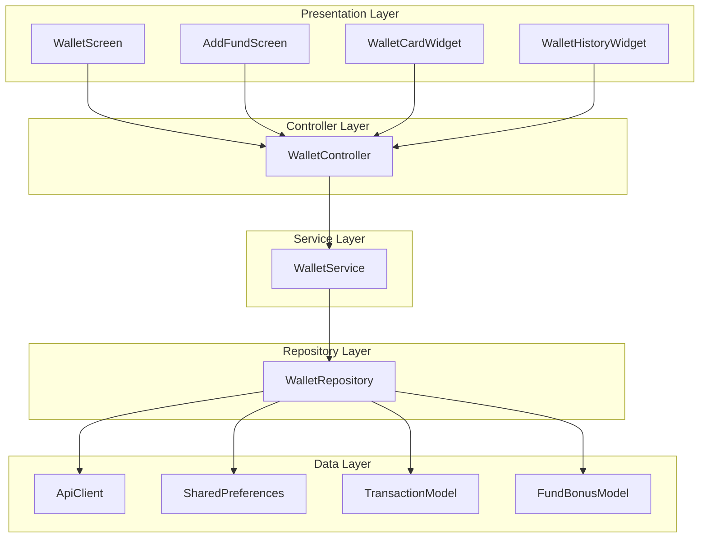
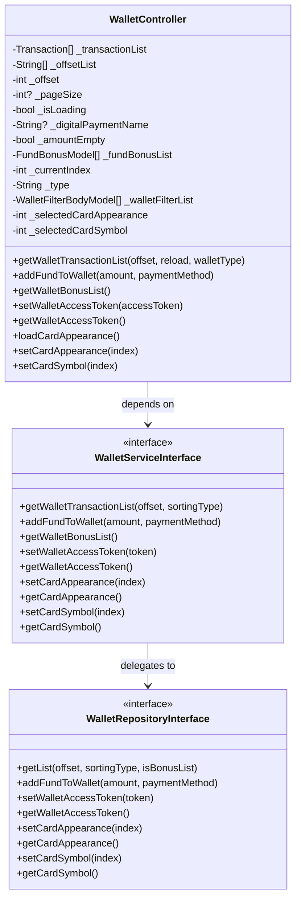
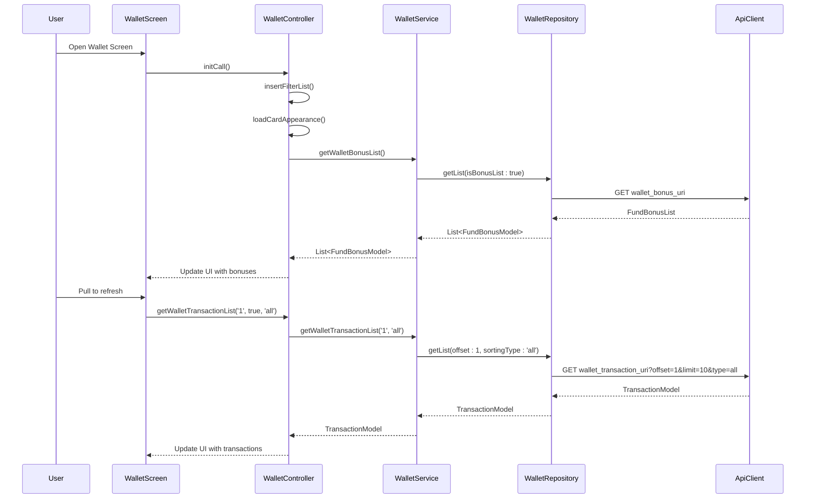
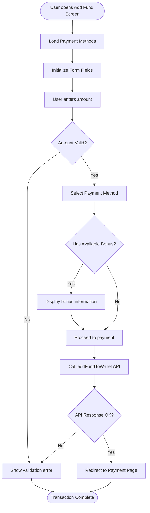
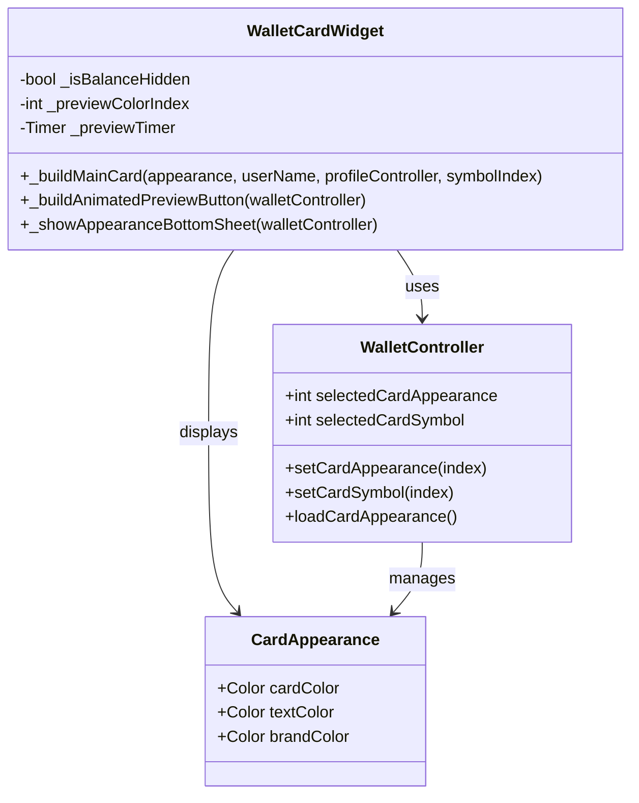
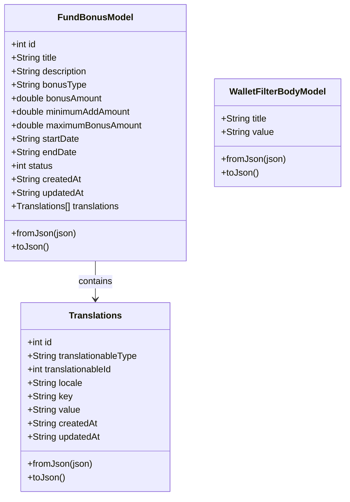

# Wallet System

<cite>
**Referenced Files in This Document**
- [wallet_controller.dart](file://lib/features/wallet/controllers/wallet_controller.dart)
- [wallet_service.dart](file://lib/features/wallet/domain/services/wallet_service.dart)
- [wallet_repository.dart](file://lib/features/wallet/domain/repositories/wallet_repository.dart)
- [wallet_screen.dart](file://lib/features/wallet/screens/wallet_screen.dart)
- [add_fund_screen.dart](file://lib/features/wallet/screens/add_fund_screen.dart)
- [wallet_card_widget.dart](file://lib/features/wallet/widgets/wallet_card_widget.dart)
- [wallet_history_widget.dart](file://lib/features/wallet/widgets/wallet_history_widget.dart)
- [fund_bonus_model.dart](file://lib/features/wallet/domain/models/fund_bonus_model.dart)
- [wallet_filter_body_model.dart](file://lib/features/wallet/domain/models/wallet_filter_body_model.dart)
</cite>

## Table of Contents
1. [Introduction](#introduction)
2. [System Architecture](#system-architecture)
3. [Core Components](#core-components)
4. [Wallet Screen](#wallet-screen)
5. [Add Fund Functionality](#add-fund-functionality)
6. [Wallet Card Management](#wallet-card-management)
7. [Transaction History](#transaction-history)
8. [Data Models](#data-models)
9. [API Integration](#api-integration)
10. [User Experience Features](#user-experience-features)
11. [Performance Considerations](#performance-considerations)
12. [Troubleshooting Guide](#troubleshooting-guide)
13. [Conclusion](#conclusion)

## Introduction

The Wallet System is a comprehensive financial management module integrated into the e-commerce platform. It provides users with the ability to manage their digital wallet balance, add funds through various payment methods, view transaction history, and customize their wallet card appearance. The system follows a layered architecture pattern with clear separation of concerns between presentation, business logic, and data access layers.

The wallet functionality encompasses three main areas: balance management, fund addition with promotional bonuses, and transaction history tracking. Users can personalize their wallet card with different color schemes and symbols, enhancing the overall user experience while maintaining security and functionality.

## System Architecture

The Wallet System follows a clean architecture pattern with distinct layers that promote maintainability, testability, and scalability.

**Diagram sources**
- [wallet_screen.dart:1-379](file://lib/features/wallet/screens/wallet_screen.dart#L1-L379)
- [add_fund_screen.dart:1-498](file://lib/features/wallet/screens/add_fund_screen.dart#L1-L498)
- [wallet_controller.dart:1-187](file://lib/features/wallet/controllers/wallet_controller.dart#L1-L187)
- [wallet_service.dart:1-55](file://lib/features/wallet/domain/services/wallet_service.dart#L1-L55)
- [wallet_repository.dart:1-110](file://lib/features/wallet/domain/repositories/wallet_repository.dart#L1-L110)

## Core Components

### WalletController

The WalletController serves as the central orchestrator for all wallet-related operations. It manages state, coordinates between different components, and handles user interactions.

**Diagram sources**
- [wallet_controller.dart:10-187](file://lib/features/wallet/controllers/wallet_controller.dart#L10-L187)
- [wallet_service.dart:7-55](file://lib/features/wallet/domain/services/wallet_service.dart#L7-L55)
- [wallet_repository.dart:11-110](file://lib/features/wallet/domain/repositories/wallet_repository.dart#L11-L110)

**Section sources**
- [wallet_controller.dart:1-187](file://lib/features/wallet/controllers/wallet_controller.dart#L1-L187)

### WalletService

The WalletService acts as a mediator between the controller and repository layers, implementing business logic and coordinating data operations.

**Section sources**
- [wallet_service.dart:1-55](file://lib/features/wallet/domain/services/wallet_service.dart#L1-L55)

### WalletRepository

The WalletRepository handles all data access operations, including API communication and local storage management.

**Section sources**
- [wallet_repository.dart:1-110](file://lib/features/wallet/domain/repositories/wallet_repository.dart#L1-L110)

## Wallet Screen

The WalletScreen serves as the main interface for wallet operations, displaying user balance, transaction history, and quick access to fund management features.

**Diagram sources**
- [wallet_screen.dart:49-118](file://lib/features/wallet/screens/wallet_screen.dart#L49-L118)
- [wallet_controller.dart:89-119](file://lib/features/wallet/controllers/wallet_controller.dart#L89-L119)
- [wallet_service.dart:11-14](file://lib/features/wallet/domain/services/wallet_service.dart#L11-L14)
- [wallet_repository.dart:65-72](file://lib/features/wallet/domain/repositories/wallet_repository.dart#L65-L72)

**Section sources**
- [wallet_screen.dart:1-379](file://lib/features/wallet/screens/wallet_screen.dart#L1-L379)

## Add Fund Functionality

The Add Fund functionality allows users to deposit money into their wallet through various payment methods with real-time validation and promotional bonus display.

**Diagram sources**
- [add_fund_screen.dart:89-101](file://lib/features/wallet/screens/add_fund_screen.dart#L89-L101)
- [wallet_controller.dart:121-137](file://lib/features/wallet/controllers/wallet_controller.dart#L121-L137)
- [wallet_repository.dart:17-29](file://lib/features/wallet/domain/repositories/wallet_repository.dart#L17-L29)

**Section sources**
- [add_fund_screen.dart:1-498](file://lib/features/wallet/screens/add_fund_screen.dart#L1-L498)

## Wallet Card Management

The wallet card management system provides extensive customization options allowing users to personalize their wallet appearance with different color schemes and symbols.

**Diagram sources**
- [wallet_card_widget.dart:21-600](file://lib/features/wallet/widgets/wallet_card_widget.dart#L21-L600)
- [wallet_controller.dart:46-50](file://lib/features/wallet/controllers/wallet_controller.dart#L46-L50)

**Section sources**
- [wallet_card_widget.dart:1-716](file://lib/features/wallet/widgets/wallet_card_widget.dart#L1-L716)

## Transaction History

The transaction history component provides users with a comprehensive view of their wallet activities, supporting filtering, pagination, and loading states.

**Section sources**
- [wallet_history_widget.dart:1-287](file://lib/features/wallet/widgets/wallet_history_widget.dart#L1-L287)

## Data Models

The wallet system utilizes several data models to represent different aspects of wallet functionality and user data.

**Diagram sources**
- [fund_bonus_model.dart:1-116](file://lib/features/wallet/domain/models/fund_bonus_model.dart#L1-L116)
- [wallet_filter_body_model.dart:1-18](file://lib/features/wallet/domain/models/wallet_filter_body_model.dart#L1-L18)

**Section sources**
- [fund_bonus_model.dart:1-116](file://lib/features/wallet/domain/models/fund_bonus_model.dart#L1-L116)
- [wallet_filter_body_model.dart:1-18](file://lib/features/wallet/domain/models/wallet_filter_body_model.dart#L1-L18)

## API Integration

The wallet system integrates with backend APIs for transaction retrieval, fund addition, and bonus information management.

**Section sources**
- [wallet_repository.dart:65-84](file://lib/features/wallet/domain/repositories/wallet_repository.dart#L65-L84)

## User Experience Features

### Responsive Design

The wallet system supports both mobile and desktop interfaces with adaptive layouts and optimized interactions for different screen sizes.

### Loading States

The system implements comprehensive loading states including shimmer animations during data fetching and progress indicators during user actions.

### Error Handling

Robust error handling mechanisms provide user feedback for validation errors, network issues, and system failures.

### Personalization

Users can customize their wallet card appearance with multiple color schemes and decorative symbols, enhancing personal engagement with the wallet system.

## Performance Considerations

### Pagination Implementation

The wallet system implements efficient pagination to handle large transaction histories without performance degradation.

### State Management

GetX framework provides reactive state management with minimal rebuilds and optimal performance characteristics.

### Memory Management

Proper disposal of timers, controllers, and listeners prevents memory leaks and ensures smooth operation.

### Caching Strategy

Local storage integration with SharedPreferences enables offline access to wallet preferences and cached data.

## Troubleshooting Guide

### Common Issues

**Wallet Balance Not Updating**
- Verify API connectivity and authentication tokens
- Check network permissions and firewall settings
- Ensure proper initialization of WalletController

**Payment Method Selection Issues**
- Confirm active payment methods configuration
- Verify payment gateway integration status
- Check browser compatibility for web payments

**Transaction History Loading Problems**
- Monitor API response times and error codes
- Implement retry mechanisms for failed requests
- Verify pagination parameters and offsets

**Card Appearance Not Persisting**
- Check SharedPreferences write permissions
- Verify data serialization/deserialization
- Ensure proper initialization sequence

### Debugging Tips

Enable debug mode to monitor controller updates and API responses. Use logging to track state changes and identify performance bottlenecks.

## Conclusion

The Wallet System represents a comprehensive solution for digital wallet management within the e-commerce platform. Its layered architecture promotes maintainability and scalability while providing an excellent user experience through intuitive interfaces and extensive customization options.

The system successfully balances functionality with performance, offering users complete control over their wallet operations while maintaining security and reliability. The modular design allows for easy extension and modification as business requirements evolve.

Key strengths include the responsive design supporting multiple platforms, comprehensive error handling, and extensive personalization options. The clean architecture facilitates future enhancements and ensures long-term maintainability of the wallet functionality.