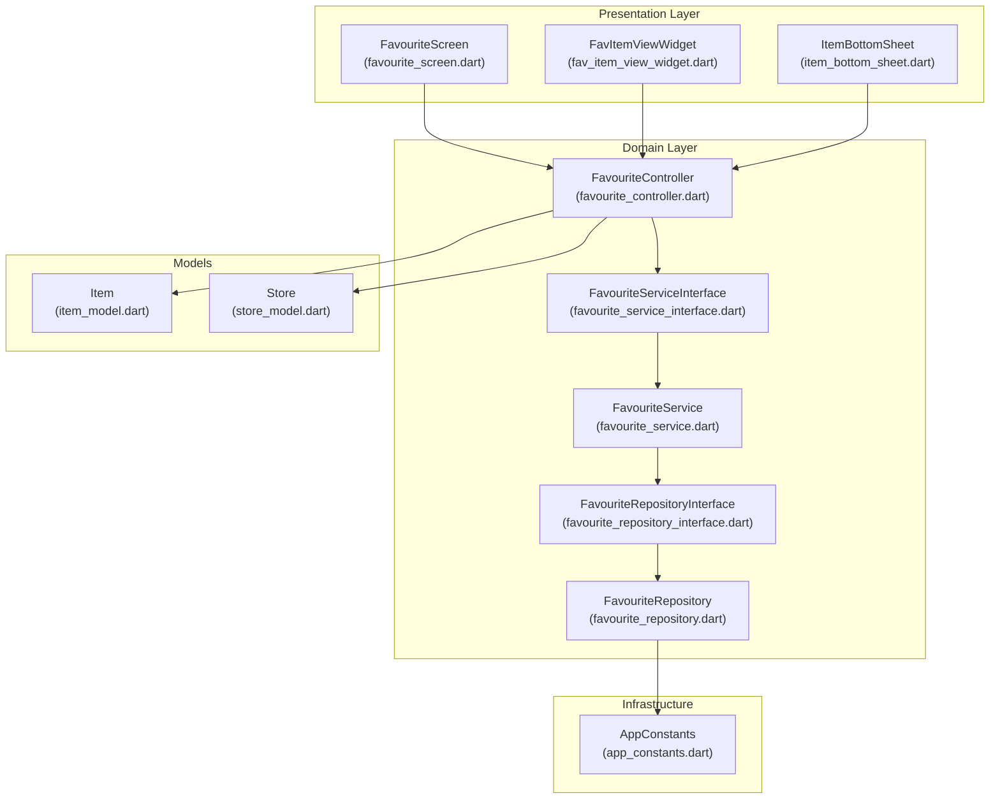
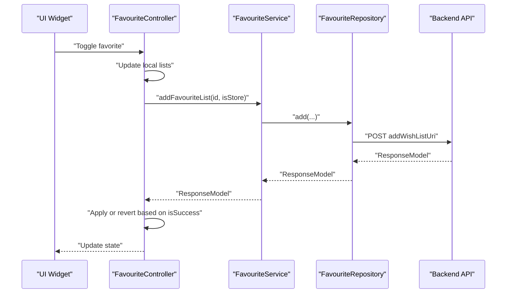
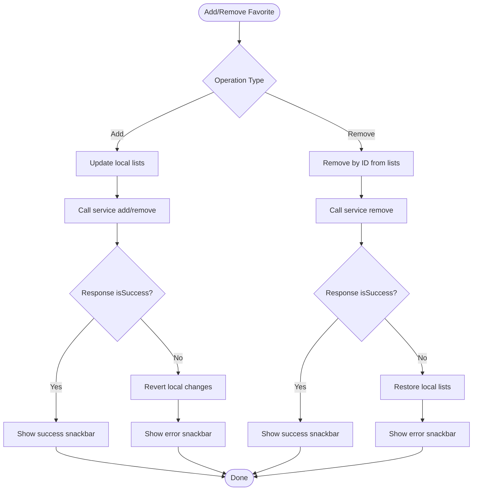
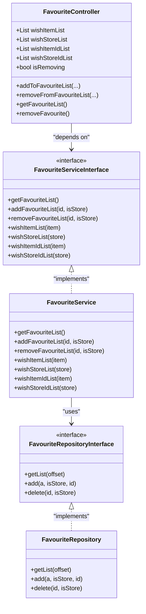
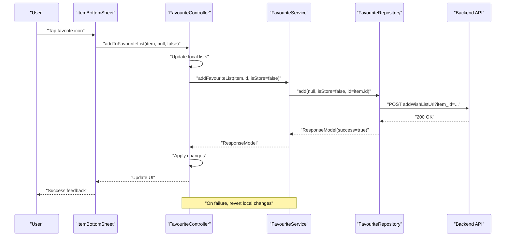
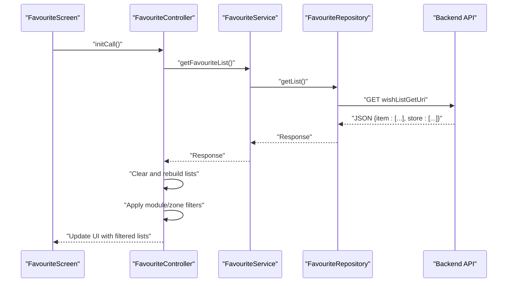

# Wishlist and Favorites

<cite>
**Referenced Files in This Document**
- [favourite_controller.dart](file://lib/features/favourite/controllers/favourite_controller.dart)
- [favourite_service_interface.dart](file://lib/features/favourite/domain/services/favourite_service_interface.dart)
- [favourite_service.dart](file://lib/features/favourite/domain/services/favourite_service.dart)
- [favourite_repository.dart](file://lib/features/favourite/domain/repositories/favourite_repository.dart)
- [favourite_repository_interface.dart](file://lib/features/favourite/domain/repositories/favourite_repository_interface.dart)
- [favourite_screen.dart](file://lib/features/favourite/screens/favourite_screen.dart)
- [fav_item_view_widget.dart](file://lib/features/favourite/widgets/fav_item_view_widget.dart)
- [item_model.dart](file://lib/features/item/domain/models/item_model.dart)
- [store_model.dart](file://lib/features/store/domain/models/store_model.dart)
- [app_constants.dart](file://lib/util/app_constants.dart)
- [item_bottom_sheet.dart](file://lib/common/widgets/item_bottom_sheet.dart)
</cite>

## Table of Contents
1. [Introduction](#introduction)
2. [Project Structure](#project-structure)
3. [Core Components](#core-components)
4. [Architecture Overview](#architecture-overview)
5. [Detailed Component Analysis](#detailed-component-analysis)
6. [Dependency Analysis](#dependency-analysis)
7. [Performance Considerations](#performance-considerations)
8. [Troubleshooting Guide](#troubleshooting-guide)
9. [Conclusion](#conclusion)

## Introduction
This document explains the wishlist and favorites system, focusing on how products and stores are saved, how favorites are toggled, and how lists are managed. It covers the controller’s role in user preference management, synchronization with backend services, and handling duplicates. It also documents the model structure for items and stores, the repository’s data access patterns, and the service’s business logic. Practical examples illustrate adding/removing favorites, list refresh, and integration touchpoints with product catalogs, user profiles, and recommendation systems. Finally, it addresses performance considerations for large lists, caching strategies, and offline preference synchronization.

## Project Structure
The wishlist/favorites feature is organized by layers:
- Controllers manage UI state and user actions.
- Services encapsulate business logic and orchestrate repository calls.
- Repositories handle network/API interactions.
- Models define product and store structures.
- Screens and widgets render the UI and bind to controller state.
- Constants define backend endpoints.

**Diagram sources**
- [favourite_screen.dart:1-123](file://lib/features/favourite/screens/favourite_screen.dart#L1-L123)
- [fav_item_view_widget.dart:1-89](file://lib/features/favourite/widgets/fav_item_view_widget.dart#L1-L89)
- [item_bottom_sheet.dart:413-432](file://lib/common/widgets/item_bottom_sheet.dart#L413-L432)
- [favourite_controller.dart:1-162](file://lib/features/favourite/controllers/favourite_controller.dart#L1-L162)
- [favourite_service_interface.dart:1-14](file://lib/features/favourite/domain/services/favourite_service_interface.dart#L1-L14)
- [favourite_service.dart:1-88](file://lib/features/favourite/domain/services/favourite_service.dart#L1-L88)
- [favourite_repository_interface.dart:1-8](file://lib/features/favourite/domain/repositories/favourite_repository_interface.dart#L1-L8)
- [favourite_repository.dart:1-50](file://lib/features/favourite/domain/repositories/favourite_repository.dart#L1-L50)
- [item_model.dart:1-433](file://lib/features/item/domain/models/item_model.dart#L1-L433)
- [store_model.dart:1-646](file://lib/features/store/domain/models/store_model.dart#L1-L646)
- [app_constants.dart:18-226](file://lib/util/app_constants.dart#L18-L226)

**Section sources**
- [favourite_controller.dart:1-162](file://lib/features/favourite/controllers/favourite_controller.dart#L1-L162)
- [favourite_service_interface.dart:1-14](file://lib/features/favourite/domain/services/favourite_service_interface.dart#L1-L14)
- [favourite_service.dart:1-88](file://lib/features/favourite/domain/services/favourite_service.dart#L1-L88)
- [favourite_repository.dart:1-50](file://lib/features/favourite/domain/repositories/favourite_repository.dart#L1-L50)
- [favourite_repository_interface.dart:1-8](file://lib/features/favourite/domain/repositories/favourite_repository_interface.dart#L1-L8)
- [favourite_screen.dart:1-123](file://lib/features/favourite/screens/favourite_screen.dart#L1-L123)
- [fav_item_view_widget.dart:1-89](file://lib/features/favourite/widgets/fav_item_view_widget.dart#L1-L89)
- [item_model.dart:1-433](file://lib/features/item/domain/models/item_model.dart#L1-L433)
- [store_model.dart:1-646](file://lib/features/store/domain/models/store_model.dart#L1-L646)
- [app_constants.dart:18-226](file://lib/util/app_constants.dart#L18-L226)
- [item_bottom_sheet.dart:413-432](file://lib/common/widgets/item_bottom_sheet.dart#L413-L432)

## Core Components
- FavouriteController: Manages in-memory favorite lists for items and stores, coordinates add/remove operations, and refreshes the list from the backend. It tracks removal state to avoid UI flicker during operations.
- FavouriteService: Implements business logic for retrieving favorites and delegating add/remove operations to the repository. Provides list filtering based on user zone and module context.
- FavouriteRepository: Performs network requests against the backend endpoints for getting, adding, and removing favorites.
- Models: Item and Store models define product and store structures used across the system.
- UI: FavouriteScreen renders tabs for items and stores; FavItemViewWidget displays lists and triggers refresh; ItemBottomSheet integrates toggle actions.

Key responsibilities:
- Product saving: addToFavouriteList handles both items and stores via a unified interface.
- Favorite toggling: removeFromFavouriteList removes by ID and reverts on failure.
- List management: getFavouriteList fetches remote data and updates local lists; removeFavourite clears all favorites.
- Duplicate handling: The controller maintains separate ID lists to prevent duplicate entries locally before sync.

**Section sources**
- [favourite_controller.dart:10-162](file://lib/features/favourite/controllers/favourite_controller.dart#L10-L162)
- [favourite_service.dart:9-88](file://lib/features/favourite/domain/services/favourite_service.dart#L9-L88)
- [favourite_repository.dart:7-50](file://lib/features/favourite/domain/repositories/favourite_repository.dart#L7-L50)
- [item_model.dart:59-282](file://lib/features/item/domain/models/item_model.dart#L59-L282)
- [store_model.dart:33-271](file://lib/features/store/domain/models/store_model.dart#L33-L271)
- [favourite_screen.dart:16-123](file://lib/features/favourite/screens/favourite_screen.dart#L16-L123)
- [fav_item_view_widget.dart:11-89](file://lib/features/favourite/widgets/fav_item_view_widget.dart#L11-L89)
- [item_bottom_sheet.dart:413-432](file://lib/common/widgets/item_bottom_sheet.dart#L413-L432)

## Architecture Overview
The system follows a layered architecture:
- Presentation: Screens and widgets observe controller state and trigger actions.
- Domain: Controller depends on a service interface; service depends on a repository interface.
- Infrastructure: Repository uses constants for endpoint URIs and an API client to communicate with the backend.
- Models: Strong typing for Item and Store supports serialization/deserialization and UI rendering.

**Diagram sources**
- [favourite_controller.dart:29-62](file://lib/features/favourite/controllers/favourite_controller.dart#L29-L62)
- [favourite_service.dart:18-21](file://lib/features/favourite/domain/services/favourite_service.dart#L18-L21)
- [favourite_repository.dart:16-26](file://lib/features/favourite/domain/repositories/favourite_repository.dart#L16-L26)
- [app_constants.dart:63-65](file://lib/util/app_constants.dart#L63-L65)

**Section sources**
- [favourite_controller.dart:29-62](file://lib/features/favourite/controllers/favourite_controller.dart#L29-L62)
- [favourite_service.dart:18-21](file://lib/features/favourite/domain/services/favourite_service.dart#L18-L21)
- [favourite_repository.dart:16-26](file://lib/features/favourite/domain/repositories/favourite_repository.dart#L16-L26)
- [app_constants.dart:63-65](file://lib/util/app_constants.dart#L63-L65)

## Detailed Component Analysis

### FavouriteController
Responsibilities:
- Maintain in-memory lists for items and stores.
- Track removal state to stabilize UI during async operations.
- Add/remove favorites and reflect backend responses immediately or revert on failure.
- Fetch favorites from backend and populate lists, applying module/zone filters.

Processing logic highlights:
- addToFavouriteList: Updates local lists first, then calls service; on failure, reverts local changes and shows feedback.
- removeFromFavouriteList: Removes by ID from both lists and arrays; on failure, restores previous state.
- getFavouriteList: Clears and rebuilds lists from response; applies module/zone checks; delegates list expansion to service for filtered results.

**Diagram sources**
- [favourite_controller.dart:29-105](file://lib/features/favourite/controllers/favourite_controller.dart#L29-L105)

**Section sources**
- [favourite_controller.dart:10-162](file://lib/features/favourite/controllers/favourite_controller.dart#L10-L162)

### FavouriteService
Responsibilities:
- Delegate list retrieval to repository.
- Delegate add/remove operations to repository.
- Provide filtered lists for items and stores based on user zone and module context.

Filtering logic:
- wishItemList and wishStoreList: Compare module ID and zone ID against user address zone data to include only relevant favorites.

**Section sources**
- [favourite_service.dart:9-88](file://lib/features/favourite/domain/services/favourite_service.dart#L9-L88)

### FavouriteRepository
Responsibilities:
- Retrieve favorites list via GET.
- Add favorites via POST with either item_id or store_id.
- Remove favorites via DELETE with either item_id or store_id.
- Return ResponseModel indicating success or error.

Endpoints:
- GET wish list: AppConstants.wishListGetUri
- POST add favorite: AppConstants.addWishListUri + "?item_id=" or "?store_id="
- DELETE remove favorite: AppConstants.removeWishListUri + "?item_id=" or "?store_id="

**Section sources**
- [favourite_repository.dart:7-50](file://lib/features/favourite/domain/repositories/favourite_repository.dart#L7-L50)
- [app_constants.dart:63-65](file://lib/util/app_constants.dart#L63-L65)

### UI Integration
- FavouriteScreen: Initializes tabbed views for items and stores, triggers getFavouriteList when logged in.
- FavItemViewWidget: Renders empty state or lists, supports pull-to-refresh to reload favorites.
- ItemBottomSheet: Toggles favorites for items and shows login-required feedback.

**Section sources**
- [favourite_screen.dart:23-123](file://lib/features/favourite/screens/favourite_screen.dart#L23-L123)
- [fav_item_view_widget.dart:11-89](file://lib/features/favourite/widgets/fav_item_view_widget.dart#L11-L89)
- [item_bottom_sheet.dart:413-432](file://lib/common/widgets/item_bottom_sheet.dart#L413-L432)

### Model Structure
- Item: Contains identifiers, pricing, availability, module/zone metadata, and nutrition/allergy/generic info. Used to represent favorites for products.
- Store: Contains identifiers, contact, operational flags, ratings, module/zone metadata, and related items. Used to represent favorites for stores.

These models support JSON serialization/deserialization and are used across screens and controllers.

**Section sources**
- [item_model.dart:59-282](file://lib/features/item/domain/models/item_model.dart#L59-L282)
- [store_model.dart:33-271](file://lib/features/store/domain/models/store_model.dart#L33-L271)

## Architecture Overview
The system adheres to clean architecture:
- Controller observes service interface, enabling testability and inversion of control.
- Service depends on repository interface, isolating business logic from infrastructure.
- Repository depends on constants and API client, centralizing endpoint definitions.
- Models are independent and serializable, supporting UI rendering and persistence.

**Diagram sources**
- [favourite_controller.dart:10-27](file://lib/features/favourite/controllers/favourite_controller.dart#L10-L27)
- [favourite_service_interface.dart:6-14](file://lib/features/favourite/domain/services/favourite_service_interface.dart#L6-L14)
- [favourite_service.dart:9-26](file://lib/features/favourite/domain/services/favourite_service.dart#L9-L26)
- [favourite_repository_interface.dart:3-8](file://lib/features/favourite/domain/repositories/favourite_repository_interface.dart#L3-L8)
- [favourite_repository.dart:7-50](file://lib/features/favourite/domain/repositories/favourite_repository.dart#L7-L50)

## Detailed Component Analysis

### Favorite Toggle Flow (Add/Remove)

**Diagram sources**
- [item_bottom_sheet.dart:413-425](file://lib/common/widgets/item_bottom_sheet.dart#L413-L425)
- [favourite_controller.dart:29-62](file://lib/features/favourite/controllers/favourite_controller.dart#L29-L62)
- [favourite_service.dart:18-21](file://lib/features/favourite/domain/services/favourite_service.dart#L18-L21)
- [favourite_repository.dart:16-26](file://lib/features/favourite/domain/repositories/favourite_repository.dart#L16-L26)
- [app_constants.dart:63-65](file://lib/util/app_constants.dart#L63-L65)

### List Management and Filtering

**Diagram sources**
- [favourite_screen.dart:35-39](file://lib/features/favourite/screens/favourite_screen.dart#L35-L39)
- [favourite_controller.dart:107-154](file://lib/features/favourite/controllers/favourite_controller.dart#L107-L154)
- [favourite_service.dart:13-16](file://lib/features/favourite/domain/services/favourite_service.dart#L13-L16)
- [favourite_repository.dart:11-14](file://lib/features/favourite/domain/repositories/favourite_repository.dart#L11-L14)
- [app_constants.dart:63-63](file://lib/util/app_constants.dart#L63-L63)

### Bulk Operations and Sharing
- Bulk add/remove: The current implementation operates per item/store. There is no explicit bulk endpoint in the repository; operations are performed individually.
- List sharing: No dedicated sharing mechanism is present in the controller or service. Favorites are user-scoped and retrieved via the centralized GET endpoint.

Recommendations:
- Introduce batch endpoints on the backend and corresponding repository/service methods for bulk operations.
- Provide export/import or share-as-link capabilities by generating shareable URLs from the current list IDs.

**Section sources**
- [favourite_repository.dart:11-38](file://lib/features/favourite/domain/repositories/favourite_repository.dart#L11-L38)
- [favourite_service.dart:13-26](file://lib/features/favourite/domain/services/favourite_service.dart#L13-L26)

### Integration Touchpoints
- Product catalogs: Item models carry module/zone metadata; filtering ensures only relevant favorites are shown.
- User profiles: Favorites are fetched from the centralized endpoint; user address zone data drives filtering.
- Recommendation engines: While not directly implemented here, the presence of suggestion endpoints indicates potential future integration with recommendation systems.

**Section sources**
- [item_model.dart:141-219](file://lib/features/item/domain/models/item_model.dart#L141-L219)
- [favourite_service.dart:28-86](file://lib/features/favourite/domain/services/favourite_service.dart#L28-L86)
- [app_constants.dart:84-85](file://lib/util/app_constants.dart#L84-L85)

## Dependency Analysis
- Controller depends on Service interface, promoting testability.
- Service depends on Repository interface, decoupling business logic from data access.
- Repository depends on constants and API client, centralizing endpoint definitions.
- UI components depend on Controller for state and actions.

**Diagram sources**
- [favourite_controller.dart:10-12](file://lib/features/favourite/controllers/favourite_controller.dart#L10-L12)
- [favourite_service_interface.dart:6-14](file://lib/features/favourite/domain/services/favourite_service_interface.dart#L6-L14)
- [favourite_service.dart:9-11](file://lib/features/favourite/domain/services/favourite_service.dart#L9-L11)
- [favourite_repository_interface.dart:3-8](file://lib/features/favourite/domain/repositories/favourite_repository_interface.dart#L3-L8)
- [favourite_repository.dart:7-9](file://lib/features/favourite/domain/repositories/favourite_repository.dart#L7-L9)
- [app_constants.dart:63-65](file://lib/util/app_constants.dart#L63-L65)

**Section sources**
- [favourite_controller.dart:10-12](file://lib/features/favourite/controllers/favourite_controller.dart#L10-L12)
- [favourite_service_interface.dart:6-14](file://lib/features/favourite/domain/services/favourite_service_interface.dart#L6-L14)
- [favourite_service.dart:9-11](file://lib/features/favourite/domain/services/favourite_service.dart#L9-L11)
- [favourite_repository_interface.dart:3-8](file://lib/features/favourite/domain/repositories/favourite_repository_interface.dart#L3-L8)
- [favourite_repository.dart:7-9](file://lib/features/favourite/domain/repositories/favourite_repository.dart#L7-L9)
- [app_constants.dart:63-65](file://lib/util/app_constants.dart#L63-L65)

## Performance Considerations
- Large favorite lists:
  - Pagination: Implement offset-based pagination in getList to reduce payload size.
  - Virtualization: Use ListView.builder in UI to render only visible items.
  - Debounced refresh: Coalesce rapid refresh triggers to avoid redundant network calls.
- Caching strategies:
  - Local cache: Persist favorites in shared preferences or a lightweight database for offline access.
  - ETag/Last-Modified: Use conditional requests to minimize bandwidth.
  - Zone/module filtering: Apply filtering client-side after partial loads to reduce memory footprint.
- Offline preference synchronization:
  - Queue operations: Record add/remove actions locally when offline; replay on reconnect.
  - Conflict resolution: Detect duplicates and merge strategies (e.g., last-write-wins).
  - Staged sync: Sync in batches to avoid blocking UI.

## Troubleshooting Guide
Common issues and resolutions:
- Toggle fails but local state updates:
  - Symptom: Snackbars indicate error; items remain in lists.
  - Resolution: Controller reverts local changes on failure; retry after connectivity check.
- Empty lists after refresh:
  - Symptom: Pull-to-refresh does not load favorites.
  - Resolution: Verify authentication status and endpoint responses; ensure module/zone filters match user context.
- Duplicate entries:
  - Symptom: Same item appears multiple times.
  - Resolution: Controller maintains ID lists; ensure add/remove operations are not bypassed and that filtering logic is applied consistently.

Operational references:
- Add/remove feedback and revert logic in controller.
- Module/zone filtering in service methods.
- Endpoint constants for correctness.

**Section sources**
- [favourite_controller.dart:42-59](file://lib/features/favourite/controllers/favourite_controller.dart#L42-L59)
- [favourite_service.dart:28-86](file://lib/features/favourite/domain/services/favourite_service.dart#L28-L86)
- [app_constants.dart:63-65](file://lib/util/app_constants.dart#L63-L65)

## Conclusion
The wishlist and favorites system is structured around a clean separation of concerns: controllers manage UI state and user actions, services encapsulate business logic, and repositories handle backend communication. The design supports robust add/remove operations, list refresh, and filtering aligned with user zones and modules. For production readiness, consider implementing bulk operations, caching, and offline synchronization to improve scalability and resilience.