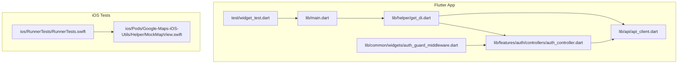
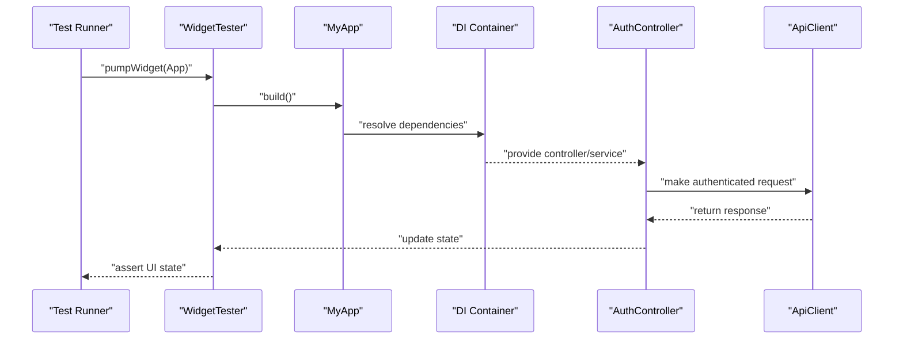
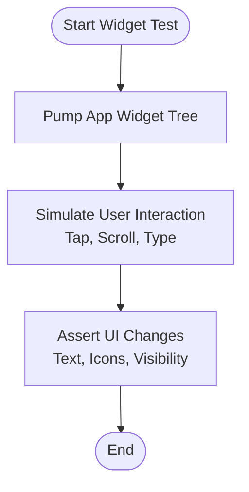
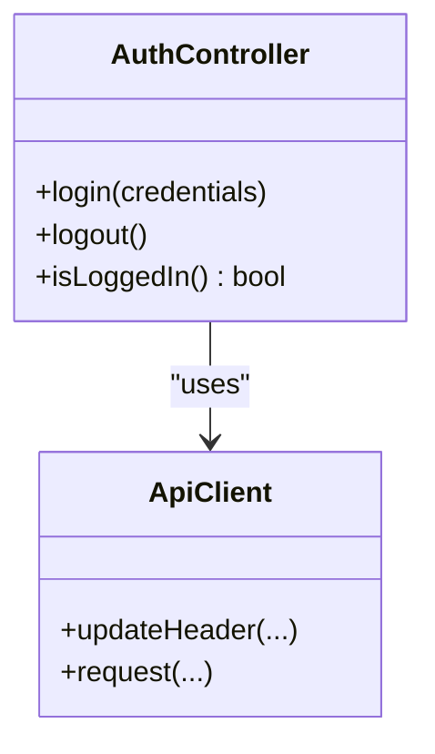
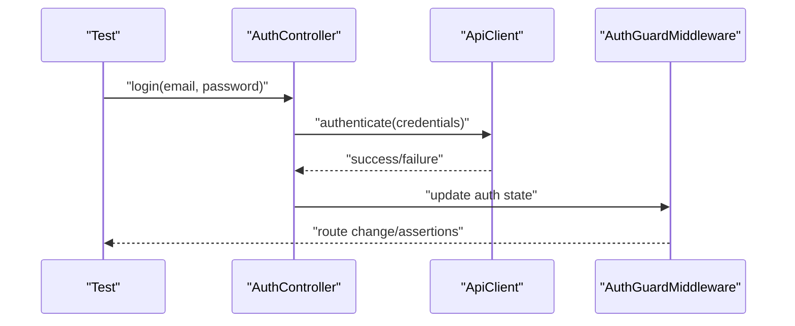
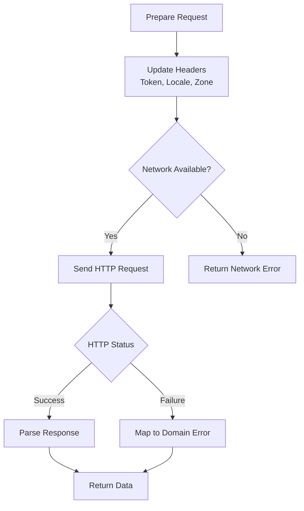
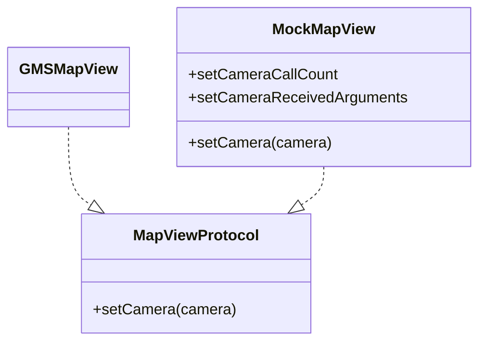
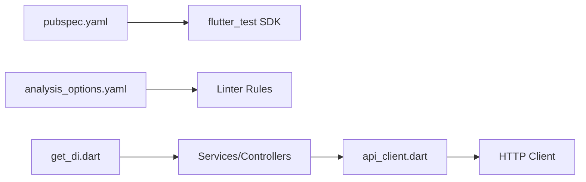

# Testing Strategy

<cite>
**Referenced Files in This Document**
- [pubspec.yaml](file://pubspec.yaml)
- [analysis_options.yaml](file://analysis_options.yaml)
- [widget_test.dart](file://test/widget_test.dart)
- [main.dart](file://lib/main.dart)
- [get_di.dart](file://lib/helper/get_di.dart)
- [api_client.dart](file://lib/api/api_client.dart)
- [auth_controller.dart](file://lib/features/auth/controllers/auth_controller.dart)
- [auth_guard_middleware.dart](file://lib/common/widgets/auth_guard_middleware.dart)
- [MockMapView.swift](file://ios/Pods/Google-Maps-iOS-Utils/Sources/GoogleMapsUtils/Helper/MockMapView.swift)
- [RunnerTests.swift](file://ios/RunnerTests/RunnerTests.swift)
</cite>

## Table of Contents
1. [Introduction](#introduction)
2. [Project Structure](#project-structure)
3. [Core Components](#core-components)
4. [Architecture Overview](#architecture-overview)
5. [Detailed Component Analysis](#detailed-component-analysis)
6. [Dependency Analysis](#dependency-analysis)
7. [Performance Considerations](#performance-considerations)
8. [Troubleshooting Guide](#troubleshooting-guide)
9. [Conclusion](#conclusion)
10. [Appendices](#appendices)

## Introduction
This document defines a comprehensive testing strategy for the project, covering unit testing, widget testing, integration testing, and mock data management. It explains the current test setup, testing frameworks, and utilities, and provides practical guidance for writing effective tests for controllers, services, and UI components. It also outlines approaches for testing authentication flows, API interactions, asynchronous operations, error handling, and edge cases, along with CI and coverage recommendations. The guidance is grounded in the repository’s existing structure and dependencies.

## Project Structure
The project is a Flutter application with a conventional modular structure. Testing is currently minimal, with a single widget smoke test and a small subset of iOS unit tests. The application uses dependency injection via a DI container and integrates with Firebase and HTTP clients for backend interactions.

**Diagram sources**
- [main.dart](file://lib/main.dart)
- [get_di.dart](file://lib/helper/get_di.dart)
- [api_client.dart](file://lib/api/api_client.dart)
- [auth_controller.dart](file://lib/features/auth/controllers/auth_controller.dart)
- [auth_guard_middleware.dart](file://lib/common/widgets/auth_guard_middleware.dart)
- [widget_test.dart](file://test/widget_test.dart)
- [RunnerTests.swift](file://ios/RunnerTests/RunnerTests.swift)
- [MockMapView.swift](file://ios/Pods/Google-Maps-iOS-Utils/Sources/GoogleMapsUtils/Helper/MockMapView.swift)

**Section sources**
- [pubspec.yaml](file://pubspec.yaml)
- [analysis_options.yaml](file://analysis_options.yaml)
- [widget_test.dart](file://test/widget_test.dart)
- [main.dart](file://lib/main.dart)
- [get_di.dart](file://lib/helper/get_di.dart)
- [api_client.dart](file://lib/api/api_client.dart)
- [auth_controller.dart](file://lib/features/auth/controllers/auth_controller.dart)
- [auth_guard_middleware.dart](file://lib/common/widgets/auth_guard_middleware.dart)
- [RunnerTests.swift](file://ios/RunnerTests/RunnerTests.swift)
- [MockMapView.swift](file://ios/Pods/Google-Maps-iOS-Utils/Sources/GoogleMapsUtils/Helper/MockMapView.swift)

## Core Components
- Test framework and configuration
  - Flutter test SDK is declared for testing.
  - Linter rules are configured via Flutter’s recommended set.
- Current test coverage
  - A single widget smoke test exists.
  - iOS unit tests exist but are placeholders.
- Dependency injection for testing
  - A DI container registers services and controllers lazily, enabling controlled instantiation during tests.
- API client and headers
  - The HTTP client reads tokens and preferences from shared storage and updates headers accordingly, which impacts testability and requires mocking or stubbing in tests.

Practical implications:
- Unit tests should focus on pure logic and isolate external dependencies (HTTP, storage).
- Widget tests should render the app shell and interact with UI components.
- Integration tests should validate controller-service-API flows with mocked network responses.

**Section sources**
- [pubspec.yaml](file://pubspec.yaml)
- [analysis_options.yaml](file://analysis_options.yaml)
- [widget_test.dart](file://test/widget_test.dart)
- [get_di.dart](file://lib/helper/get_di.dart)
- [api_client.dart](file://lib/api/api_client.dart)

## Architecture Overview
The testing architecture leverages Flutter’s testing stack for UI and unit tests, with a DI-driven service layer and an HTTP client for API interactions. Authentication and authorization logic are encapsulated in controllers and middleware, while the DI container wires services and repositories.

**Diagram sources**
- [widget_test.dart](file://test/widget_test.dart)
- [main.dart](file://lib/main.dart)
- [get_di.dart](file://lib/helper/get_di.dart)
- [auth_controller.dart](file://lib/features/auth/controllers/auth_controller.dart)
- [api_client.dart](file://lib/api/api_client.dart)

## Detailed Component Analysis

### Widget Testing
- Purpose: Validate UI rendering and basic interactions.
- Current state: A smoke test verifies a counter increment flow.
- Recommendations:
  - Add tests for screen transitions, form submissions, and state changes.
  - Use test widgets to simulate user gestures and assert rendered text and icons.
  - Keep tests focused on UI behavior; avoid testing business logic.

**Diagram sources**
- [widget_test.dart](file://test/widget_test.dart)

**Section sources**
- [widget_test.dart](file://test/widget_test.dart)

### Unit Testing Controllers and Services
- Focus areas:
  - Controller logic: state updates, navigation triggers, and validation.
  - Service logic: business rules, transformations, and orchestrations.
- Strategies:
  - Inject mocks for repositories and APIs.
  - Use isolated tests for pure functions and stateless logic.
  - Parameterized tests for edge cases and invalid inputs.

**Diagram sources**
- [auth_controller.dart](file://lib/features/auth/controllers/auth_controller.dart)
- [api_client.dart](file://lib/api/api_client.dart)

**Section sources**
- [auth_controller.dart](file://lib/features/auth/controllers/auth_controller.dart)
- [api_client.dart](file://lib/api/api_client.dart)

### Integration Testing: Authentication Flows
- Scope:
  - Login/logout flows, token handling, and protected routes.
  - Middleware enforcement for authenticated access.
- Approach:
  - Replace DI-provided services with test doubles.
  - Simulate network responses and error scenarios.
  - Verify route changes and UI updates after auth events.

**Diagram sources**
- [auth_controller.dart](file://lib/features/auth/controllers/auth_controller.dart)
- [api_client.dart](file://lib/api/api_client.dart)
- [auth_guard_middleware.dart](file://lib/common/widgets/auth_guard_middleware.dart)

**Section sources**
- [auth_controller.dart](file://lib/features/auth/controllers/auth_controller.dart)
- [auth_guard_middleware.dart](file://lib/common/widgets/auth_guard_middleware.dart)

### API Interaction Testing
- Scope:
  - HTTP requests, headers, and response parsing.
  - Offline and error scenarios.
- Approach:
  - Wrap HTTP client in an interface or use a testable abstraction.
  - Mock network responses and timeouts.
  - Validate header composition and token propagation.

**Diagram sources**
- [api_client.dart](file://lib/api/api_client.dart)

**Section sources**
- [api_client.dart](file://lib/api/api_client.dart)

### iOS Integration Testing (Native Layer)
- Scope:
  - Native map utilities and protocols.
  - Example: mock map view protocol for testing camera operations.
- Approach:
  - Use protocol-based abstractions to replace real implementations with mocks.
  - Validate call counts and arguments in unit tests.

**Diagram sources**
- [MockMapView.swift](file://ios/Pods/Google-Maps-iOS-Utils/Sources/GoogleMapsUtils/Helper/MockMapView.swift)

**Section sources**
- [MockMapView.swift](file://ios/Pods/Google-Maps-iOS-Utils/Sources/GoogleMapsUtils/Helper/MockMapView.swift)

## Dependency Analysis
- Flutter test SDK is present for widget and unit tests.
- Linter configuration enables consistent code quality.
- DI container centralizes service creation and is ideal for injecting test doubles.
- API client depends on shared preferences and environment-specific settings, requiring careful isolation in tests.

**Diagram sources**
- [pubspec.yaml](file://pubspec.yaml)
- [analysis_options.yaml](file://analysis_options.yaml)
- [get_di.dart](file://lib/helper/get_di.dart)
- [api_client.dart](file://lib/api/api_client.dart)

**Section sources**
- [pubspec.yaml](file://pubspec.yaml)
- [analysis_options.yaml](file://analysis_options.yaml)
- [get_di.dart](file://lib/helper/get_di.dart)
- [api_client.dart](file://lib/api/api_client.dart)

## Performance Considerations
- Prefer lightweight widget tests for UI checks; reserve integration tests for critical flows.
- Use test doubles to avoid real network calls and database writes.
- Keep test fixtures small and deterministic to reduce flakiness.
- Parallelize independent tests where possible.

## Troubleshooting Guide
- Widget tests fail to render:
  - Ensure the app is pumpable and pass required constructor parameters.
  - Verify that the DI container is initialized before tests run.
- Authentication tests fail:
  - Stub shared preferences and token storage.
  - Mock the API client to return controlled responses.
- iOS tests:
  - Expand placeholder tests to cover native logic and protocols.
  - Use protocol-based mocks to validate behavior without real devices.

**Section sources**
- [widget_test.dart](file://test/widget_test.dart)
- [get_di.dart](file://lib/helper/get_di.dart)
- [api_client.dart](file://lib/api/api_client.dart)
- [RunnerTests.swift](file://ios/RunnerTests/RunnerTests.swift)

## Conclusion
The project has a solid foundation for testing with Flutter’s built-in testing stack, a DI container, and an HTTP client. By expanding unit, widget, and integration tests, and by adopting protocol-based mocking and controlled test data, the team can achieve reliable, maintainable, and fast test suites. CI and coverage policies should be introduced to enforce quality gates.

## Appendices

### Test Setup Checklist
- Install and configure Flutter test SDK.
- Enable linter rules for consistent code quality.
- Initialize the DI container in test environments.
- Create test doubles for services, repositories, and HTTP client.
- Write widget tests for critical UI flows.
- Write unit tests for controllers and services.
- Write integration tests for key API flows and authentication.

### Continuous Integration and Coverage
- Run widget and unit tests on every commit.
- Enforce minimum coverage thresholds for controllers and services.
- Gate PRs on passing tests and coverage metrics.
- Publish test reports and artifacts for traceability.