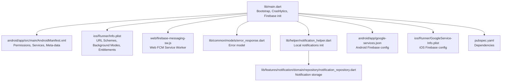
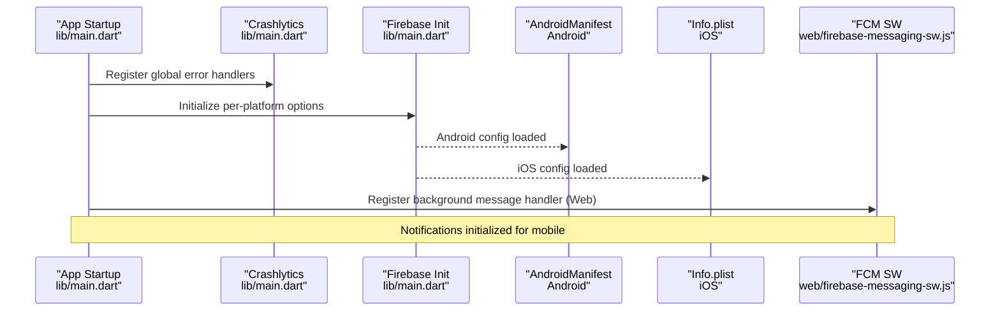
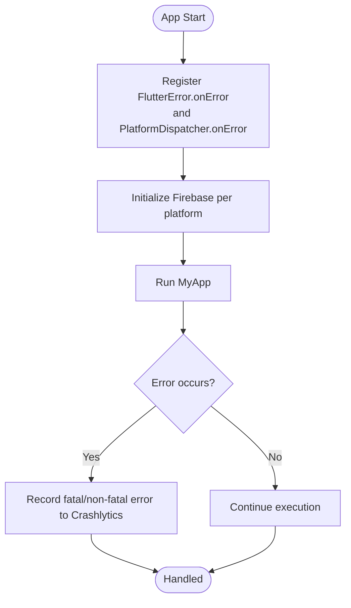
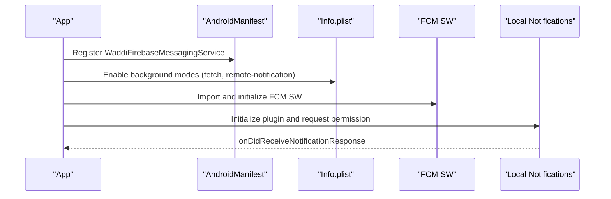
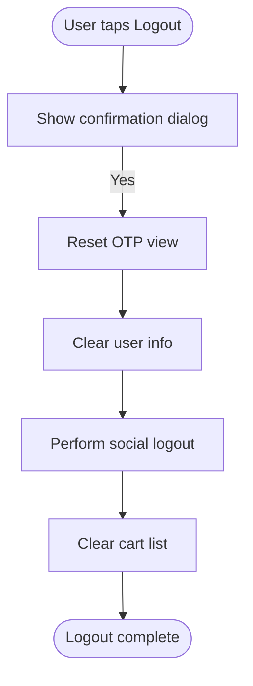
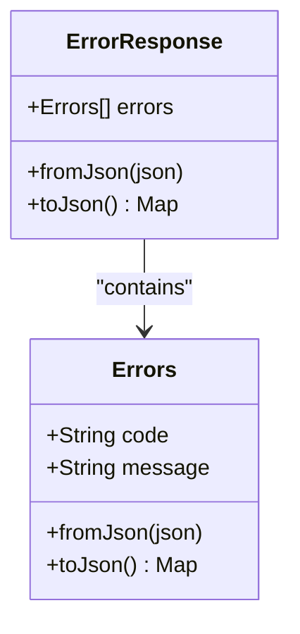
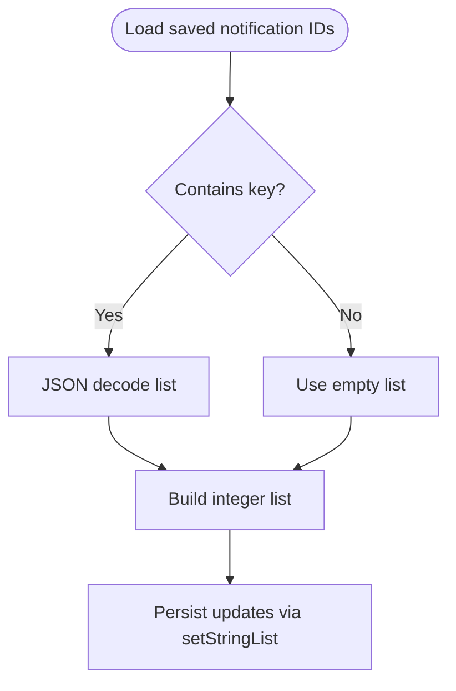
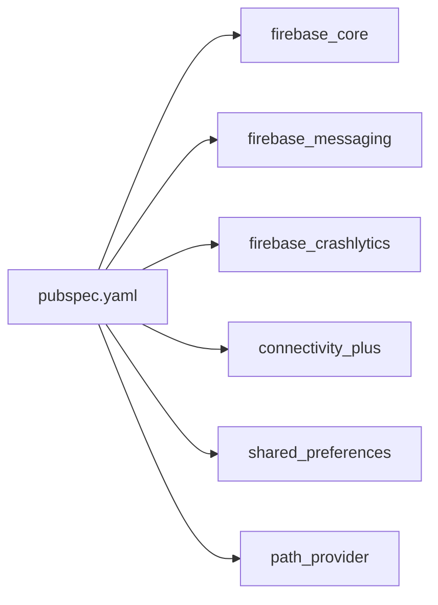

# Troubleshooting and FAQ

<cite>
**Referenced Files in This Document**
- [lib/main.dart](file://lib/main.dart)
- [android/app/src/main/AndroidManifest.xml](file://android/app/src/main/AndroidManifest.xml)
- [ios/Runner/Info.plist](file://ios/Runner/Info.plist)
- [pubspec.yaml](file://pubspec.yaml)
- [android/app/google-services.json](file://android/app/google-services.json)
- [ios/Runner/GoogleService-Info.plist](file://ios/Runner/GoogleService-Info.plist)
- [web/firebase-messaging-sw.js](file://web/firebase-messaging-sw.js)
- [lib/common/models/error_response.dart](file://lib/common/models/error_response.dart)
- [lib/helper/notification_helper.dart](file://lib/helper/notification_helper.dart)
- [lib/features/notification/domain/repository/notification_repository.dart](file://lib/features/notification/domain/repository/notification_repository.dart)
- [lib/features/auth/domain/enum/centralize_login_enum.dart](file://lib/features/auth/domain/enum/centralize_login_enum.dart)
- [lib/features/menu/screens/menu_screen.dart](file://lib/features/menu/screens/menu_screen.dart)
</cite>

## Table of Contents
1. [Introduction](#introduction)
2. [Project Structure](#project-structure)
3. [Core Components](#core-components)
4. [Architecture Overview](#architecture-overview)
5. [Detailed Component Analysis](#detailed-component-analysis)
6. [Dependency Analysis](#dependency-analysis)
7. [Performance Considerations](#performance-considerations)
8. [Troubleshooting Guide](#troubleshooting-guide)
9. [FAQ](#faq)
10. [Conclusion](#conclusion)
11. [Appendices](#appendices)

## Introduction
This document provides comprehensive troubleshooting guidance for the Waddi user application. It focuses on diagnosing and resolving common issues across platforms, including application crashes, authentication failures, network connectivity problems, and UI rendering anomalies. It also covers debugging tools usage, log analysis techniques, error reporting mechanisms, performance tuning, memory leak detection, battery drain analysis, and frequently asked questions about development environment setup, dependency conflicts, and deployment issues. Emergency response procedures and escalation workflows are included to support rapid incident resolution.

## Project Structure
The application is a Flutter-based multi-platform project with platform-specific configurations for Android and iOS, alongside web support. Key areas relevant to troubleshooting include:
- Application bootstrap and global error handling
- Platform manifests and entitlements
- Firebase initialization and messaging configuration
- Error model structures
- Notification handling and persistence
- Authentication flow controls

**Diagram sources**
- [lib/main.dart:35-103](file://lib/main.dart#L35-L103)
- [android/app/src/main/AndroidManifest.xml:1-111](file://android/app/src/main/AndroidManifest.xml#L1-L111)
- [ios/Runner/Info.plist:1-110](file://ios/Runner/Info.plist#L1-L110)
- [web/firebase-messaging-sw.js:1-40](file://web/firebase-messaging-sw.js#L1-L40)
- [lib/common/models/error_response.dart:1-52](file://lib/common/models/error_response.dart#L1-L52)
- [lib/helper/notification_helper.dart:27-51](file://lib/helper/notification_helper.dart#L27-L51)
- [lib/features/notification/domain/repository/notification_repository.dart:31-78](file://lib/features/notification/domain/repository/notification_repository.dart#L31-L78)
- [android/app/google-services.json:1-29](file://android/app/google-services.json#L1-L29)
- [ios/Runner/GoogleService-Info.plist:1-30](file://ios/Runner/GoogleService-Info.plist#L1-L30)
- [pubspec.yaml:1-122](file://pubspec.yaml#L1-L122)

**Section sources**
- [lib/main.dart:35-103](file://lib/main.dart#L35-L103)
- [android/app/src/main/AndroidManifest.xml:1-111](file://android/app/src/main/AndroidManifest.xml#L1-L111)
- [ios/Runner/Info.plist:1-110](file://ios/Runner/Info.plist#L1-L110)
- [pubspec.yaml:1-122](file://pubspec.yaml#L1-L122)

## Core Components
- Global error capture and crash reporting via Firebase Crashlytics
- Platform-specific Firebase initialization with separate configs per platform
- Web FCM service worker for background notifications
- Local notification initialization and click handling
- Shared preferences-backed notification ID lists
- Error response model for structured error payloads
- Authentication logout flow and centralized login types

**Section sources**
- [lib/main.dart:44-52](file://lib/main.dart#L44-L52)
- [lib/main.dart:54-76](file://lib/main.dart#L54-L76)
- [web/firebase-messaging-sw.js:1-40](file://web/firebase-messaging-sw.js#L1-L40)
- [lib/helper/notification_helper.dart:27-51](file://lib/helper/notification_helper.dart#L27-L51)
- [lib/features/notification/domain/repository/notification_repository.dart:31-78](file://lib/features/notification/domain/repository/notification_repository.dart#L31-L78)
- [lib/common/models/error_response.dart:1-52](file://lib/common/models/error_response.dart#L1-L52)
- [lib/features/auth/domain/enum/centralize_login_enum.dart:1-9](file://lib/features/auth/domain/enum/centralize_login_enum.dart#L1-L9)
- [lib/features/menu/screens/menu_screen.dart:288-315](file://lib/features/menu/screens/menu_screen.dart#L288-L315)

## Architecture Overview
The application integrates Firebase services for crash reporting, messaging, and authentication. The main entrypoint sets up platform-specific Firebase configurations, registers global error handlers, and initializes notifications. Platform manifests define required permissions and background modes.

**Diagram sources**
- [lib/main.dart:44-52](file://lib/main.dart#L44-L52)
- [lib/main.dart:54-76](file://lib/main.dart#L54-L76)
- [android/app/src/main/AndroidManifest.xml:1-111](file://android/app/src/main/AndroidManifest.xml#L1-L111)
- [ios/Runner/Info.plist:1-110](file://ios/Runner/Info.plist#L1-L110)
- [web/firebase-messaging-sw.js:1-40](file://web/firebase-messaging-sw.js#L1-L40)

## Detailed Component Analysis

### Crash Reporting and Error Capture
- Fatal Flutter errors and unhandled platform errors are captured and forwarded to Firebase Crashlytics.
- Debug mode overrides HTTP client certificate validation for local development.

**Diagram sources**
- [lib/main.dart:44-52](file://lib/main.dart#L44-L52)
- [lib/main.dart:35-103](file://lib/main.dart#L35-L103)

**Section sources**
- [lib/main.dart:44-52](file://lib/main.dart#L44-L52)
- [lib/main.dart:241-249](file://lib/main.dart#L241-L249)

### Firebase Messaging and Notifications
- Android and iOS register FCM services and default notification channel.
- Web uses a service worker to handle background messages.
- Local notifications initialization requests permission and handles taps.

**Diagram sources**
- [android/app/src/main/AndroidManifest.xml:101-107](file://android/app/src/main/AndroidManifest.xml#L101-L107)
- [ios/Runner/Info.plist:80-84](file://ios/Runner/Info.plist#L80-L84)
- [web/firebase-messaging-sw.js:1-40](file://web/firebase-messaging-sw.js#L1-L40)
- [lib/helper/notification_helper.dart:27-51](file://lib/helper/notification_helper.dart#L27-L51)

**Section sources**
- [android/app/src/main/AndroidManifest.xml:101-107](file://android/app/src/main/AndroidManifest.xml#L101-L107)
- [ios/Runner/Info.plist:80-84](file://ios/Runner/Info.plist#L80-L84)
- [web/firebase-messaging-sw.js:1-40](file://web/firebase-messaging-sw.js#L1-L40)
- [lib/helper/notification_helper.dart:27-51](file://lib/helper/notification_helper.dart#L27-L51)

### Authentication Logout Flow
- Logout triggers confirmation dialog and clears user session data across controllers.

**Diagram sources**
- [lib/features/menu/screens/menu_screen.dart:288-315](file://lib/features/menu/screens/menu_screen.dart#L288-L315)

**Section sources**
- [lib/features/menu/screens/menu_screen.dart:288-315](file://lib/features/menu/screens/menu_screen.dart#L288-L315)

### Error Model and Payload Handling
- Structured error response model supports arrays of errors with code and message fields.

**Diagram sources**
- [lib/common/models/error_response.dart:1-52](file://lib/common/models/error_response.dart#L1-L52)

**Section sources**
- [lib/common/models/error_response.dart:1-52](file://lib/common/models/error_response.dart#L1-L52)

### Notification Persistence and Counters
- Notification seen count and ID lists are persisted via shared preferences with JSON encoding/decoding.

**Diagram sources**
- [lib/features/notification/domain/repository/notification_repository.dart:31-78](file://lib/features/notification/domain/repository/notification_repository.dart#L31-L78)

**Section sources**
- [lib/features/notification/domain/repository/notification_repository.dart:31-78](file://lib/features/notification/domain/repository/notification_repository.dart#L31-L78)

## Dependency Analysis
- Flutter SDK and Dart SDK constraints are defined in pubspec.
- Firebase packages (core, messaging, crashlytics) are integrated with platform-specific configurations.
- Connectivity and local storage dependencies support offline and persistence scenarios.

**Diagram sources**
- [pubspec.yaml:9-86](file://pubspec.yaml#L9-L86)

**Section sources**
- [pubspec.yaml:1-122](file://pubspec.yaml#L1-L122)

## Performance Considerations
- Battery drain and CPU usage can be influenced by background fetch, remote notifications, and location services. Review background modes and ensure periodic tasks are throttled appropriately.
- Network requests should be optimized with caching and retry policies. Use connectivity checks to avoid unnecessary retries.
- UI rendering performance can degrade with heavy animations or large image loads; leverage lazy loading and efficient widgets.
- Memory leaks often originate from retained streams, timers, or large closures. Use profiling tools to identify retained objects and dispose subscriptions properly.

[No sources needed since this section provides general guidance]

## Troubleshooting Guide

### Application Crashes
- Symptom: App terminates unexpectedly.
- Actions:
  - Verify global error handlers are registered during startup.
  - Check Crashlytics reports for fatal/non-fatal errors.
  - Reproduce with debugger detached on iOS to ensure crash logs are captured.
  - Review recent changes around native interop and background tasks.

**Section sources**
- [lib/main.dart:44-52](file://lib/main.dart#L44-L52)
- [ios/Runner/Info.plist:1-110](file://ios/Runner/Info.plist#L1-L110)

### Authentication Failures
- Symptom: Login/logout fails or session inconsistencies.
- Actions:
  - Confirm centralized login type configuration aligns with user expectations.
  - Verify logout flow clears OTP, user info, and cart data.
  - Check platform-specific OAuth/SSO configurations and URL schemes.

**Section sources**
- [lib/features/auth/domain/enum/centralize_login_enum.dart:1-9](file://lib/features/auth/domain/enum/centralize_login_enum.dart#L1-L9)
- [lib/features/menu/screens/menu_screen.dart:288-315](file://lib/features/menu/screens/menu_screen.dart#L288-L315)
- [ios/Runner/Info.plist:25-52](file://ios/Runner/Info.plist#L25-L52)

### Network Connectivity Issues
- Symptom: Requests timeout or fail intermittently.
- Actions:
  - Use connectivity_plus to detect network status.
  - Validate Firebase configs for Android and iOS are correct.
  - Ensure cleartext traffic policy matches environment requirements.

**Section sources**
- [pubspec.yaml:16-16](file://pubspec.yaml#L16-L16)
- [android/app/google-services.json:1-29](file://android/app/google-services.json#L1-L29)
- [ios/Runner/GoogleService-Info.plist:1-30](file://ios/Runner/GoogleService-Info.plist#L1-L30)

### UI Rendering Problems
- Symptom: Stutters, blank screens, or incorrect layouts.
- Actions:
  - Disable animations temporarily to isolate rendering bottlenecks.
  - Verify media queries and text scaling settings.
  - Check platform-specific overlay styles and safe areas.

**Section sources**
- [lib/main.dart:146-152](file://lib/main.dart#L146-L152)
- [lib/main.dart:188-231](file://lib/main.dart#L188-L231)

### Notification and Messaging Problems
- Symptom: No push notifications or background message handling issues.
- Actions:
  - Confirm Android/iOS services and default notification channel are declared.
  - Validate web FCM service worker is loaded and registered.
  - Ensure local notifications initialization requests permission and handles taps.

**Section sources**
- [android/app/src/main/AndroidManifest.xml:66-68](file://android/app/src/main/AndroidManifest.xml#L66-L68)
- [web/firebase-messaging-sw.js:1-40](file://web/firebase-messaging-sw.js#L1-L40)
- [lib/helper/notification_helper.dart:27-51](file://lib/helper/notification_helper.dart#L27-L51)

### Error Reporting and Log Analysis
- Symptom: Unclear error context or missing logs.
- Actions:
  - Use Crashlytics fatal/non-fatal reports to correlate timestamps and stacks.
  - Add structured error payloads using the ErrorResponse model for API errors.
  - On iOS, ensure debugger is detached to capture crash logs; review console logs for handler conflicts.

**Section sources**
- [lib/common/models/error_response.dart:1-52](file://lib/common/models/error_response.dart#L1-L52)
- [lib/main.dart:44-52](file://lib/main.dart#L44-L52)
- [ios/Runner/Info.plist:1-110](file://ios/Runner/Info.plist#L1-L110)

### Platform-Specific Challenges
- Android:
  - Permissions and background services must be declared in the manifest.
  - Cleartext traffic policy affects local development and testing.
- iOS:
  - Background modes and URL schemes must be configured.
  - Entitlements and privacy descriptions are required for sensitive APIs.

**Section sources**
- [android/app/src/main/AndroidManifest.xml:8-36](file://android/app/src/main/AndroidManifest.xml#L8-L36)
- [ios/Runner/Info.plist:61-84](file://ios/Runner/Info.plist#L61-L84)

### Performance Troubleshooting
- Memory Leaks:
  - Use heap snapshots and retain graphs to identify leaked objects.
  - Dispose streams, timers, and listeners on view dispose.
- Battery Drain:
  - Audit background fetch intervals and remote notification handling.
  - Limit high-frequency polling and heavy computations in background.

[No sources needed since this section provides general guidance]

### Frequently Asked Questions (FAQ)

- How do I set up the development environment?
  - Install Flutter SDK and platform toolchains as per official guides.
  - Ensure Android Studio and Xcode are installed with latest versions.
  - Configure Firebase configs for Android and iOS using provided JSON/plist files.

- Why am I seeing certificate errors locally?
  - Debug mode overrides HTTP client certificate validation to accept invalid certs for local testing.

- How do I verify Firebase messaging is working?
  - Confirm service declarations in Android/iOS manifests and web service worker registration.

- What permissions are required?
  - Android requires internet, location, audio, and notification permissions.
  - iOS requires camera/microphone/photo library and location usage descriptions.

- How do I clear user session data?
  - Use the logout flow which resets OTP, clears user info, performs social logout, and clears the cart.

**Section sources**
- [lib/main.dart:38-40](file://lib/main.dart#L38-L40)
- [android/app/src/main/AndroidManifest.xml:8-12](file://android/app/src/main/AndroidManifest.xml#L8-L12)
- [ios/Runner/Info.plist:68-75](file://ios/Runner/Info.plist#L68-L75)
- [lib/features/menu/screens/menu_screen.dart:288-315](file://lib/features/menu/screens/menu_screen.dart#L288-L315)

### Escalation Procedures and Support Resources
- Immediate steps:
  - Capture Crashlytics reports and logs.
  - Isolate platform-specific issues using platform manifests and configs.
- Internal escalation:
  - Assign tickets to platform owners (Android/iOS/Web).
  - Include reproducible steps, device logs, and screenshots.
- Community and official resources:
  - Flutter forums and GitHub Discussions.
  - Firebase support and Crashlytics dashboards.
  - Platform-specific developer communities (Android Developers, Apple Developer Forums).

[No sources needed since this section summarizes support processes]

### Emergency Response Procedures
- Critical crash hotfix:
  - Roll back recent changes and redeploy a stable build.
  - Temporarily disable problematic features via feature flags.
- High-severity outage:
  - Notify stakeholders and activate on-call rotation.
  - Monitor Crashlytics and analytics dashboards for impact trends.
- Post-mortem:
  - Document root causes, remediation steps, and preventive measures.

[No sources needed since this section provides general guidance]

## Conclusion
This guide consolidates practical troubleshooting strategies for the Waddi user application across platforms. By leveraging built-in error capture, validating platform configurations, and following structured diagnostics, teams can quickly resolve crashes, authentication issues, connectivity problems, and UI anomalies. Adopting the recommended performance and battery optimization practices ensures long-term stability and user satisfaction.

[No sources needed since this section summarizes without analyzing specific files]

## Appendices

### Quick Reference: Common Checks
- Crashlytics: Fatal and non-fatal error capture enabled.
- Firebase: Correct project configs for Android/iOS/web.
- Permissions: All required permissions declared in platform manifests.
- Notifications: Service workers and local notification initialization verified.
- Logout: OTP, user info, and cart cleared on logout.

**Section sources**
- [lib/main.dart:44-52](file://lib/main.dart#L44-L52)
- [android/app/google-services.json:1-29](file://android/app/google-services.json#L1-L29)
- [ios/Runner/GoogleService-Info.plist:1-30](file://ios/Runner/GoogleService-Info.plist#L1-L30)
- [android/app/src/main/AndroidManifest.xml:8-12](file://android/app/src/main/AndroidManifest.xml#L8-L12)
- [web/firebase-messaging-sw.js:1-40](file://web/firebase-messaging-sw.js#L1-L40)
- [lib/features/menu/screens/menu_screen.dart:288-315](file://lib/features/menu/screens/menu_screen.dart#L288-L315)